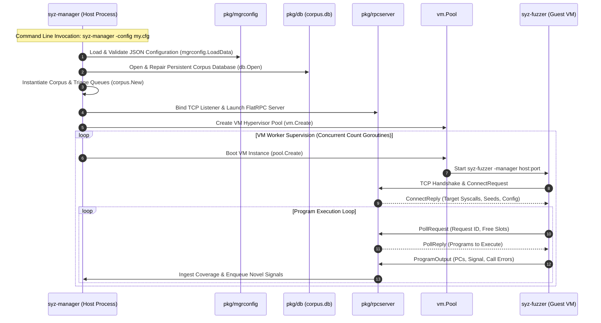

# Day 01: `syz-manager` Overview & Startup Lifecycle

⏱️ **Est. Reading Time**: 9–12 minutes (1453 words)

📂 **Key Source Files**: [`syz-manager/manager.go`](../syz-manager/manager.go), [`pkg/mgrconfig/config.go`](../pkg/mgrconfig/config.go), [`pkg/rpcserver/rpcserver.go`](../pkg/rpcserver/rpcserver.go), [`vm/vm.go`](../vm/vm.go)

---

## 1. Architectural Motivation & System Context

In syzkaller's multi-process architecture, `syz-manager` serves as the central supervisor process running on the host system. It does **not** execute system calls directly, nor does it run mutated test programs in its own process space. Instead, `syz-manager` acts as an orchestration hub:

1. **State Isolation**: Isolates the host OS from guest kernel crashes, memory corruption, and panic states.
2. **Resource Allocation**: Supervises virtual machine pools (QEMU, GCE, isolated hosts) and dynamically scales test workloads.
3. **Corpus & Signal Synchronization**: Acts as the single source of truth for execution coverage, persistent program databases (`workdir/corpus.db`), and corpus triage queues.
4. **Crash Processing & Triage Engine**: Monitors guest console logs in real time, parses kernel backtraces, normalizes symbols, and triggers automated reproducer generation.



---

## 2. Configuration Subsystem (`pkg/mgrconfig`)

The startup lifecycle begins with loading and validating the JSON configuration via [`pkg/mgrconfig/config.go`](../pkg/mgrconfig/config.go).

### Configuration Validation (`mgrconfig.Config`)
The `Config` struct contains over 40 parameters controlling fuzzing targets, hypervisors, and crash thresholds:

```go
type Config struct {
    RawTarget      string          `json:"target"`       // e.g. "linux/amd64"
    HTTP           string          `json:"http"`         // HTTP server binding address (e.g. "localhost:56741")
    Workdir        string          `json:"workdir"`      // Directory storing corpus.db and crashes
    Syzkaller      string          `json:"syzkaller"`    // Path to syzkaller binary directory
    KernelObj      string          `json:"kernel_obj"`   // Path to vmlinux for symbolization
    KernelSrc      string          `json:"kernel_src"`   // Path to kernel source tree
    Target         *targets.Target `json:"-"`            // Target arch/OS specs
    Type           string          `json:"type"`         // VM type ("qemu", "gce", "isolated")
    VM             json.RawMessage `json:"vm"`           // Hypervisor-specific JSON options
    Count          int             `json:"count"`        // Number of concurrent VMs
    RPC            string          `json:"rpc"`          // RPC binding host address
    DashboardClient string         `json:"dashboard_client"` // Dashapi authentication key
    EnabledSyscalls []string        `json:"enable_syscalls"` // Syscall filter whitelist
}
```

#### Step-by-Step Validation Rules (`mgrconfig.LoadData`)
1. **Target Normalization**: Converts `target` string (e.g. `linux/amd64`) into a concrete `targets.Target` instance describing pointer sizes, page sizes, endianness, and syscall register conventions.
2. **Directory Resolution**: Validates that `workdir` exists (or creates it), and checks for `KernelObj` (`vmlinux`) availability.
3. **Syscall Filtering**: Parses `enable_syscalls` and `disable_syscalls` lists, compiling regular expressions to filter the full syscall list exported by `sys/targets`.

---

## 3. Main State Orchestrator (`syz-manager/manager.go`)

The core execution state is maintained in the `Manager` struct inside [`syz-manager/manager.go`](../syz-manager/manager.go):

```go
type Manager struct {
    cfg            *mgrconfig.Config
    target         *targets.Target
    sysTarget      *targets.Target
    corpusDB       *db.DB
    corpus         *corpus.Corpus
    serv           *rpcserver.Server
    vmPool         *vm.Pool
    mu             sync.Mutex
    crashTypes     map[string]bool
    enabledSyscalls map[*prog.Syscall]bool
    
    // Statistics counters
    statExecs      *stat.Val
    statCrashes    *stat.Val
    statCorpus     *stat.Val
    statCoverage   *stat.Val
}
```

### Detailed Component Initialization Sequence

```
[Main Entry Point: main()]
        │
        ├── 1. Parse Command-Line Flags (-config, -debug, -bench)
        │
        ├── 2. Load Configuration (mgrconfig.LoadData)
        │
        ├── 3. Open Persistent Database (db.Open("workdir/corpus.db"))
        │       ├── Perform automatic repair on corrupted tail entries
        │       └── Run compact() to strip obsolete keys
        │
        ├── 4. Initialize In-Memory Corpus (corpus.New)
        │       └── Load raw program texts into memory & build initial seed queue
        │
        ├── 5. Bind FlatRPC Server (rpcserver.New)
        │       ├── Bind TCP listener socket to host RPC IP:port
        │       └── Register connection handlers for syz-fuzzer clients
        │
        ├── 6. Instantiate Hypervisor Pool (vm.Create(cfg))
        │       └── Load VM driver (e.g. QEMU, GCE, isolated)
        │
        ├── 7. Launch HTTP Administrative Server (http.ListenAndServe)
        │       └── Expose status dashboard, coverage maps, and RPC stats
        │
        └── 8. Spawn Concurrent VM Loops (go mgr.vmLoop(index))
                └── Loop forever: boot VM -> launch syz-fuzzer -> monitor console log
```

---

## 4. The VM Worker Supervisor Loop

`syz-manager` spawns `cfg.Count` independent worker goroutines executing `vmLoop(index)`:

```go
func (mgr *Manager) vmLoop(index int) {
    for {
        // Step 1: Request a new VM instance from hypervisor pool
        inst, err := mgr.vmPool.Create(index)
        if err != nil {
            log.Logf(0, "failed to create instance %d: %v", index, err)
            time.Sleep(10 * time.Second)
            continue
        }
        
        // Step 2: Copy syz-fuzzer and target binaries to guest VM
        fuzzerBin, err := inst.Copy(mgr.cfg.SyzkallerBin)
        
        // Step 3: Run syz-fuzzer inside guest with host RPC binding flags
        cmd := fmt.Sprintf("%s -manager=%s -name=%d", fuzzerBin, mgr.serv.Addr(), index)
        outc, errc, err := inst.Run(time.Hour, mgr.serv.StopChan(), cmd)
        
        // Step 4: Stream console log output and monitor for crashes
        mgr.monitorExecution(inst, outc, errc)
        
        // Step 5: Clean up VM instance upon exit or panic
        inst.Close()
    }
}
```

---

## 💡 Dusty Corner of the Day

> [!TIP]
> **Dynamic Port Selection & Network Boundary Injection**:  
> In multi-tenant environments or automated CI clusters, hardcoding RPC ports leads to port collision errors.  
> If `rpc_port` is omitted or set to `0` in your JSON config, `syz-manager` binds to port `0`, prompting the host kernel OS to allocate an available ephemeral TCP port.  
> `syz-manager` then queries `net.Listener.Addr().Port` to retrieve the allocated port and **dynamically rewrites the command-line arguments** passed to guest VMs (`-manager=192.168.1.1:43981`), ensuring seamless parallel manager execution on shared bare-metal hosts!

---

## 🔍 Deep Dive Code Reference (Optional)

<details>
<summary>View Complete `Manager` Initialization Walkthrough</summary>

```go
// Inside syz-manager/manager.go main()
func main() {
    flag.Parse()
    cfg, err := mgrconfig.LoadFile(*flagConfig)
    if err != nil {
        log.Fatalf("failed to load config: %v", err)
    }
    
    target, err := prog.GetTarget(cfg.TargetOS, cfg.TargetArch)
    if err != nil {
        log.Fatalf("invalid target: %v", err)
    }
    
    // Open corpus database with auto-repair
    corpusDB, err := db.Open(filepath.Join(cfg.Workdir, "corpus.db"), true)
    if err != nil {
        log.Logf(0, "corpus database opened with warning: %v", err)
    }
    
    serv, err := rpcserver.New(cfg, target, corpusDB)
    if err != nil {
        log.Fatalf("failed to create RPC server: %v", err)
    }
    
    vmPool, err := vm.Create(cfg)
    if err != nil {
        log.Fatalf("failed to create VM pool: %v", err)
    }
    
    mgr := &Manager{
        cfg:      cfg,
        target:   target,
        corpusDB: corpusDB,
        serv:     serv,
        vmPool:   vmPool,
    }
    
    mgr.run()
}
```
</details>

---


## 5. Inline Code Inspection: Configuration & Booting (`syz-manager/manager.go`)

Since we are reading self-contained documentation, let's examine the exact Go configuration structure and manager startup methods directly:

```go
// pkg/mgrconfig/config.go - Core configuration schema
type Config struct {
    RawTarget       string          `json:"target"`        // OS/Arch target (e.g. "linux/amd64")
    HTTP            string          `json:"http"`          // Admin HTTP server address ("localhost:56741")
    Workdir         string          `json:"workdir"`       // Corpus and crash storage path
    Syzkaller       string          `json:"syzkaller"`     // Syzkaller bin directory
    KernelObj       string          `json:"kernel_obj"`    // vmlinux path for symbolization
    KernelSrc       string          `json:"kernel_src"`    // Kernel source root
    Type            string          `json:"type"`          // Hypervisor backend ("qemu", "gce")
    VM              json.RawMessage `json:"vm"`            // Driver-specific JSON config
    Count           int             `json:"count"`         // VM pool count
    RPC             string          `json:"rpc"`           // RPC host binding IP:port
    EnabledSyscalls []string        `json:"enable_syscalls"`// Whitelisted syscalls
}

// Sample JSON config file (my.cfg)
{
    "target": "linux/amd64",
    "http": "127.0.0.1:56741",
    "workdir": "./workdir",
    "kernel_obj": "/home/user/linux/vmlinux",
    "image": "/home/user/linux/bullseye.img",
    "syzkaller": ".",
    "type": "qemu",
    "vm": {
        "count": 4,
        "cpu": 2,
        "mem": 2048
    }
}
```

### The Manager Startup Protocol
When `syz-manager` runs `main()`, it initializes components in strict order:
1. `mgrconfig.LoadFile(*flagConfig)` loads and validates JSON parameters.
2. `db.Open(filepath.Join(cfg.Workdir, "corpus.db"), true)` opens the append-only database.
3. `rpcserver.New(cfg, target, corpusDB)` binds the host RPC socket.
4. `vm.Create(cfg)` initializes hypervisor driver pools.
5. Concurrent goroutines `go mgr.vmLoop(i)` keep `cfg.Count` VM instances continuously running.

---

## ✅ Daily Summary

1. `syz-manager` is an orchestrator: it stays out of kernel space, supervising VM pools, managing corpus storage, and serving program streams over FlatRPC.
2. `mgrconfig.LoadData` normalizes target architectures, compiles syscall whitelists, and validates directory paths.
3. The supervisor loop (`vmLoop`) maintains continuous VM pool instances, streaming serial logs to catch kernel panics immediately upon occurrence.
