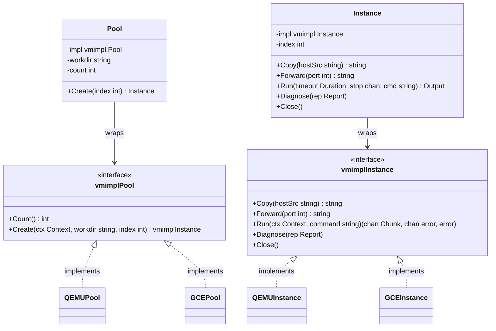

# Day 02: VM Management & Instance Abstractions

⏱️ **Est. Reading Time**: 8–11 minutes (1266 words)

📂 **Key Source Files**: [`vm/vm.go`](../vm/vm.go), [`vm/vmimpl/vmimpl.go`](../vm/vmimpl/vmimpl.go), [`pkg/instance/instance.go`](../pkg/instance/instance.go), [`vm/qemu/qemu.go`](../vm/qemu/qemu.go)

---

## 1. Architectural Motivation & Subsystem Design

Executing untrusted, mutated syscall sequences inside a kernel will inevitably cause kernel panics, memory corruption, and system deadlocks. To achieve continuous high-throughput fuzzing, syzkaller isolates execution inside Virtual Machines (VMs), emulator containers, or dedicated physical hardware.

The [`vm`](../vm/vm.go) subsystem solves three fundamental engineering challenges:
1. **Hypervisor Heterogeneity**: Exposes a single unified Go interface regardless of whether the backend hypervisor is QEMU, GCE, Android ADB, Cuttlefish, gVisor, Bhyve, or bare-metal isolated hardware.
2. **Crash & Hang Isolation**: Streams serial console logs over non-blocking pipes, detecting kernel panics and deadlocks even when guest networking halts completely.
3. **Instance Provisioning**: Automates disk image duplication, SSH key distribution, TCP port forwarding, binary staging, and guest command execution.



---

## 2. Core Go Interfaces (`vmimpl.Pool` & `vmimpl.Instance`)

Hypervisor drivers implement the low-level interfaces defined in [`vm/vmimpl/vmimpl.go`](../vm/vmimpl/vmimpl.go):

### `vmimpl.Pool`
Responsible for creating and provisioning virtual machine environments:
```go
type Pool interface {
    // Count returns total number of VMs in the pool.
    Count() int

    // Create creates and boots a new VM instance with index (0..Count-1).
    Create(ctx context.Context, workdir string, index int) (Instance, error)
}
```

### `vmimpl.Instance`
Represents an active guest VM capable of file transfer, port forwarding, command execution, and diagnostic collection:
```go
type Instance interface {
    // Copy transfers hostSrc into guest file system and returns guest file path.
    Copy(hostSrc string) (string, error)

    // Forward sets up TCP port forwarding from guest to host address.
    Forward(port int) (string, error)

    // Run executes command inside VM. Returns channels for console output chunks and exit errors.
    Run(ctx context.Context, command string) (outc <-chan Chunk, errc <-chan error, err error)

    // Diagnose captures stack traces or debug info when VM hangs or panics.
    Diagnose(rep *report.Report) ([]byte, bool)

    // Close forcefully terminates the hypervisor process and cleans temporary disks.
    Close() error
}
```

### Hypervisor Initialization Environment (`vmimpl.Env`)
When `vm.Create` instantiates a pool, it passes an environment struct to the driver constructor:

```go
type Env struct {
    Name      string          // Instance configuration identifier
    OS        string          // Target OS ("linux", "freebsd", "openbsd", "netbsd")
    Arch      string          // Target Architecture ("amd64", "arm64", "riscv64")
    Workdir   string          // Working directory storing temporary images
    Kernel    string          // Path to kernel binary (bzImage, vmlinux)
    Cmdline   string          // Kernel boot command line parameter string
    Image     string          // Disk image filepath
    Sshkey    string          // Path to SSH private key file
    Debug     bool            // If true, dumps full hypervisor console logs to stderr
}
```

---

## 3. High-Level Wrapper (`vm.Pool` & `vm.Instance`)

The outer package [`vm/vm.go`](../vm/vm.go) wraps `vmimpl` implementations with common higher-level utility functions:

```go
type Pool struct {
    impl     vmimpl.Pool
    workdir  string
    timeouts targets.Timeouts
    count    int
}

type Instance struct {
    impl      vmimpl.Instance
    index     int
    monitors  []Monitor
    workdir   string
    diagnosed uint32
}
```

### The Command Execution Engine (`Instance.Run`)
When `syz-manager` launches `syz-fuzzer` inside a guest instance, it calls `Instance.Run()`:

```go
func (inst *Instance) Run(timeout time.Duration, stop <-chan struct{}, command string) (
    <-chan Output, error) {
    
    ctx, cancel := context.WithTimeout(context.Background(), timeout)
    outc, errc, err := inst.impl.Run(ctx, command)
    if err != nil {
        cancel()
        return nil, err
    }
    
    // Create non-blocking output channel for streaming serial logs
    res := make(chan Output, 100)
    go func() {
        defer cancel()
        defer close(res)
        
        for {
            select {
            case chunk, ok := <-outc:
                if !ok {
                    return
                }
                res <- Output{Data: chunk.Data, Raw: chunk.Raw}
            case err := <-errc:
                res <- Output{Err: err}
                return
            case <-stop:
                return
            }
        }
    }()
    return res, nil
}
```

---

## 4. Driver Implementation Example: QEMU Hypervisor (`vm/qemu`)

The QEMU hypervisor driver in [`vm/qemu/qemu.go`](../vm/qemu/qemu.go) launches QEMU command-line instances using subprocess invocation:

```
[QEMU Subprocess Command Construction]
        │
        ├── -kernel /path/to/bzImage
        ├── -append "console=ttyS0 root=/dev/sda earlyprintk=serial"
        ├── -drive file=/path/to/disk.img,format=raw
        ├── -netdev user,id=net0,hostfwd=tcp::2345-:22
        ├── -device e1000,netdev=net0
        ├── -nographic -serial stdio
        └── -m 2048 -smp 2
```

Console logs stream directly over `cmd.StdoutPipe()`, while stdin/stdout controls SSH authentication or raw serial console interaction.

---

## 💡 Dusty Corner of the Day

> [!TIP]
> **Stalled Console Detection & Serial Watchdog Timers**:  
> In kernel panic scenarios, CPU cores may enter infinite spinlocks or halt interrupts without closing serial file descriptors.  
> `vm.Instance` monitors chunk timestamps. If no console log bytes or RPC heartbeats arrive within `timeouts.NoOutput` (e.g. 5 minutes), the manager triggers `inst.Diagnose()`.  
> On QEMU/GCE, `Diagnose()` sends SysRq keys (`SysRq-Q`, `SysRq-L`) over serial or triggers a hypervisor NMI (Non-Maskable Interrupt) to force a kernel backtrace dump before killing the stuck VM process!

> [!NOTE]
> **Isolated Hardware & Physical Host Provisioning**:  
> When `type` is set to `"isolated"`, syzkaller controls bare-metal server boards. Instead of spawning hypervisor child processes, `vm/isolated` uses network power outlets (PDU) and IPMI/serial-over-LAN commands to power-cycle physical machines when crashes occur!

---

## 🔍 Deep Dive Code Reference (Optional)

<details>
<summary>View Complete `vm.Create` Factory Pattern</summary>

```go
// Inside vm/vm.go
func Create(cfg *mgrconfig.Config) (*Pool, error) {
    typ := vmimpl.Types[cfg.Type]
    if typ == nil {
        return nil, fmt.Errorf("unknown VM type %q", cfg.Type)
    }
    
    env := &vmimpl.Env{
        Name:     cfg.Name,
        OS:       cfg.TargetOS,
        Arch:     cfg.TargetArch,
        Workdir:  cfg.Workdir,
        Kernel:   cfg.Kernel,
        Cmdline:  cfg.Cmdline,
        Image:    cfg.Image,
        Sshkey:   cfg.Sshkey,
        Debug:    cfg.Debug,
    }
    
    impl, err := typ.Ctor(env, cfg.VM)
    if err != nil {
        return nil, err
    }
    
    return &Pool{
        impl:    impl,
        workdir: cfg.Workdir,
        count:   impl.Count(),
    }, nil
}
```
</details>

---


## 5. Inline Code Inspection: Hypervisor Staging & QEMU Command Construction

Let's examine how `vm/qemu/qemu.go` builds hypervisor subprocess commands and monitors guest execution:

```go
// vm/qemu/qemu.go - Subprocess command construction
func (inst *instance) boot() error {
    args := []string{
        "-m", fmt.Sprintf("%d", inst.cfg.Mem),
        "-smp", fmt.Sprintf("%d", inst.cfg.Cpu),
        "-netdev", fmt.Sprintf("user,id=net0,hostfwd=tcp::%d-:22", inst.sshPort),
        "-device", "e1000,netdev=net0",
        "-nographic",
        "-serial", "stdio",
        "-snapshot",
    }
    if inst.cfg.Kernel != "" {
        args = append(args, "-kernel", inst.cfg.Kernel)
        args = append(args, "-append", inst.cfg.Cmdline)
    }
    if inst.cfg.Image != "" {
        args = append(args, "-drive", fmt.Sprintf("file=%s,format=raw", inst.image))
    }
    
    inst.cmd = osutil.Command("qemu-system-x86_64", args...)
    inst.stdout, _ = inst.cmd.StdoutPipe()
    return inst.cmd.Start()
}
```

### Staging Binaries & File Transfer (`Instance.Copy`)
Before launching test runs, `syz-manager` copies execution binaries into guest memory:
1. Executes `scp -P sshPort syz-fuzzer root@localhost:/tmp/syz-fuzzer`.
2. Marks target binaries executable (`chmod +x /tmp/syz-fuzzer`).
3. Launches `syz-fuzzer -manager=host_ip:rpc_port` over guest SSH session.

---

## ✅ Daily Summary

1. `vmimpl.Pool` and `vmimpl.Instance` Go interfaces decouple hypervisor backends (QEMU, GCE, isolated hosts) from fuzzing orchestration logic.
2. `Instance.Run()` streams stdout/stderr over non-blocking Go channels, allowing real-time crash parsing while commands execute.
3. Watchdog timers handle hung kernels by injecting SysRq/NMI diagnostics before forcefully terminating stuck VM processes.
