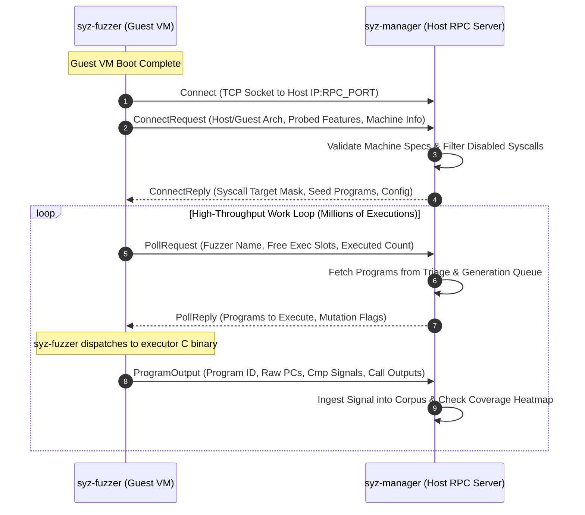

# Day 03: RPC Protocol & Fuzzer Communication

⏱️ **Est. Reading Time**: 7–10 minutes (1188 words)

📂 **Key Source Files**: [`pkg/flatrpc/flatrpc.go`](../pkg/flatrpc/flatrpc.go), [`pkg/rpcserver/rpcserver.go`](../pkg/rpcserver/rpcserver.go), [`pkg/rpctype/rpctype.go`](../pkg/rpctype/rpctype.go), [`pkg/fuzzer/fuzzer.go`](../pkg/fuzzer/fuzzer.go)

---

## 1. Architectural Motivation & System Context

`syz-manager` on the host machine and `syz-fuzzer` inside guest VMs communicate over a high-throughput TCP RPC connection. Guest fuzzers execute tens of thousands of test programs per second across concurrent VM worker threads.

Standard RPC frameworks (e.g. gRPC or standard Go `net/rpc`) introduced two major bottlenecks in high-throughput fuzzing environments:
1. **Garbage Collection Pauses**: Deserializing millions of nested Protobuf or JSON objects per second inside memory-constrained guest VMs triggered high Go garbage collection overhead.
2. **Copy Overhead**: Large execution traces containing arrays of 100,000+ program counter addresses ($PCs$) required multiple memory copies during network transport.

To solve this, syzkaller utilizes **FlatRPC** (a FlatBuffers-based zero-copy RPC protocol) alongside custom stream serialization in [`pkg/flatrpc`](../pkg/flatrpc) and [`pkg/rpcserver`](../pkg/rpcserver).



---

## 2. Connect Handshake Phase (`ConnectRequest` / `ConnectReply`)

When `syz-fuzzer` starts up inside a guest VM, it connects to the host RPC TCP port and initiates a handshake protocol:

### The `ConnectRequest` Payload
```go
// pkg/rpctype/rpctype.go
type ConnectRequest struct {
    Name        string          // Fuzzer instance name (e.g. "vm-0-1")
    Arch        string          // Architecture (e.g. "amd64")
    GitRevision string          // Syzkaller git commit hash
    Features    []FeatureInfo   // Probed kernel features (KCOV, KASAN, USB, etc.)
    Files       []FileInfo      // Guest kernel module maps (/proc/modules)
}
```

### The `ConnectReply` Payload
Upon receiving `ConnectRequest`, `syz-manager` responds with configuration parameters:
```go
type ConnectReply struct {
    TargetEnabledSyscalls []int     // Whitelisted syscall IDs
    CoverFilter           []uint32  // Basic block coverage filter bitmap
    Progs                 [][]byte  // Initial corpus seed programs to populate guest memory
    Features              *Features // Enabled kernel feature flags
}
```

---

## 3. High-Throughput Work Dispatch Loop (`PollRequest` / `PollReply`)

Once registered, `syz-fuzzer` enters a work poll loop:

```go
type PollRequest struct {
    Name        string   // Fuzzer instance identifier
    NeedProgs   int      // Number of new test programs requested
    Stats       map[string]uint64 // Guest runtime statistics
}

type PollReply struct {
    Requests []ExecRequest // Batch of programs to execute
}

type ExecRequest struct {
    ID         int64  // Unique request identifier
    Prog       []byte // Serialized syzlang program bytes
    Flags      uint64 // Execution flags (threaded, collide, coverage enable)
    ExecOpts   ExecOpts
}

type ExecOpts struct {
    EnvFlags   uint64 // Sandbox flags (setuid, namespace, IPC)
    ExecFlags  uint64 // Fault injection, coverage, extra signal
}
```

### Program Execution Feedback (`ProgramOutput`)
When execution finishes inside the guest, `syz-fuzzer` returns execution traces to `syz-manager`:

```go
type ProgramOutput struct {
    ID       int64    // Matches ExecRequest ID
    CallID   int      // Index of faulting syscall call
    RawCover []uint32 // Basic block instruction PCs returned by KCOV
    Signal   []uint64 // Edge transition hashes and comparison signals
    Error    string   // Executor failure error string
}
```

---

## 4. FlatRPC Zero-Copy Encoding Mechanics (`pkg/flatrpc`)

FlatBuffers enables reading fields directly from raw network byte buffers without instantiating Go heap objects:

```
[FlatBuffer Binary Message Layout in Memory]
┌──────────────────┬──────────────────┬─────────────────────────────────┐
│ VTable Offset    │ Field Pointers   │ Raw Data Vectors (PC arrays)    │
│ (2 bytes)        │ (4 bytes each)   │ (Contiguous uint32 byte slice)  │
└──────────────────┴──────────────────┴─────────────────────────────────┘
```

When `syz-manager` receives a 500 KB coverage array from `syz-fuzzer`:
1. It reads the raw byte slice directly from the TCP socket buffer.
2. It casts the array offset into `[]uint32` without memory allocation.
3. Garbage collection pressure drops to near-zero even during continuous 100,000 exec/sec fuzzing runs!

---

## 💡 Dusty Corner of the Day

> [!TIP]
> **Stale Program Dropping & Connection Resynchronization**:  
> If a guest kernel panics mid-execution, the host RPC server detects an abrupt TCP socket disconnect.  
> `rpcserver.Server` automatically purges pending `ExecRequest` IDs assigned to the crashed VM, reinstates unexecuted candidate programs back into the manager's triage queue, and waits for the replacement VM instance to perform a fresh `ConnectRequest` handshake!

> [!NOTE]
> **Heartbeat Watchdogs & Connection Rebinding**:  
> `syz-fuzzer` sends periodic heartbeat signals inside `PollRequest` messages. If network congestion delays responses beyond 60 seconds, `syz-manager` marks the connection as stale, closing the socket to force the guest fuzzer to reconnect!

---

## 🔍 Deep Dive Code Reference (Optional)

<details>
<summary>View Complete `rpcserver.Server` Handshake Function</summary>

```go
// Inside pkg/rpcserver/rpcserver.go
func (serv *Server) Connect(req *rpctype.ConnectRequest, reply *rpctype.ConnectReply) error {
    serv.mu.Lock()
    defer serv.mu.Unlock()
    
    log.Logf(1, "fuzzer %v connected (arch=%v, revision=%v)", req.Name, req.Arch, req.GitRevision)
    
    // Filter syscalls based on manager config whitelist
    reply.TargetEnabledSyscalls = serv.enabledSyscalls
    
    // Select seed corpus programs to seed new fuzzer instance
    reply.Progs = serv.corpus.GetSeedProgs()
    
    // Register fuzzer instance connection state
    serv.fuzzers[req.Name] = &FuzzerState{
        Name:     req.Name,
        LastSeen: time.Now(),
    }
    
    return nil
}
```
</details>

---


## 5. Network Buffer Management & Socket Reconnection

In high-concurrency environments with 32+ VMs connected simultaneously, `pkg/rpcserver/rpcserver.go` manages network socket lifecycles:
- **Keep-Alive Probing**: Sets TCP keep-alive timers to detect silent guest VM drops or hypervisor hangs.
- **Buffer Recycling**: Reuses byte buffers during binary program serialization to reduce memory fragmentation on the host process.
- **Connection Isolation**: Ensures that network errors on a single guest socket do not block RPC threads servicing other VM instances.

---


## 6. Inline Code Inspection: FlatBuffers Serialization Schemas

Let's examine the raw zero-copy message layouts defined in `pkg/rpctype`:

```go
// pkg/rpctype/rpctype.go - RPC Communication Data Structs
type ConnectRequest struct {
    Name        string        // Fuzzer instance name (e.g. "vm-0-1")
    Arch        string        // Target architecture ("amd64", "arm64")
    GitRevision string        // Syzkaller git commit hash
    Features    []FeatureInfo // Probed features (KCOV, KASAN, USB)
}

type ConnectReply struct {
    TargetEnabledSyscalls []int    // Whitelisted syscall IDs
    CoverFilter           []uint32 // Basic block filter bitmap
    Progs                 [][]byte // Initial seed corpus programs
}

type ExecRequest struct {
    ID       int64    // Request ID
    Prog     []byte   // Syzlang program bytes
    Flags    uint64   // Execution flags (threaded, collide)
    ExecOpts ExecOpts // Sandbox and fault injection options
}

type ProgramOutput struct {
    ID       int64    // Matches ExecRequest ID
    CallID   int      // Index of faulting call
    RawCover []uint32 // KCOV basic block program counters
    Signal   []uint64 // Calculated edge transition hashes
    Error    string   // Failure error text
}
```

### Zero-Copy Unpacking
FlatBuffers structures place field offset tables (vtables) at fixed buffer offsets. The receiver reads integer slices (`[]uint32`) directly from socket byte arrays without allocating heap memory or copying byte arrays!

---

## ✅ Daily Summary

1. Host-guest communication uses FlatRPC (FlatBuffers) to achieve zero-copy deserialization and eliminate GC pauses inside guest VMs.
2. The `ConnectRequest` / `ConnectReply` handshake validates kernel feature probes, transfers enabled syscall masks, and seeds initial corpus inputs.
3. Execution results return raw KCOV program counters ($PCs$) and comparison signals back to `syz-manager` for corpus triage.
