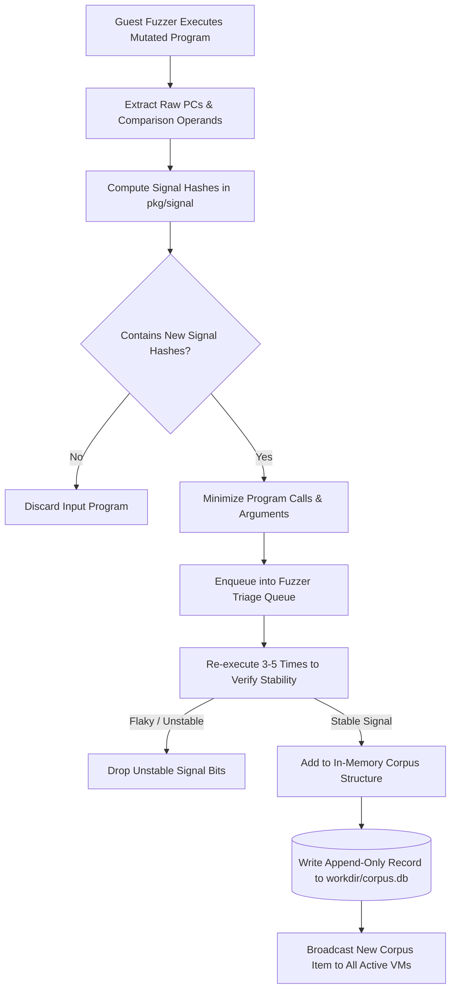

# Day 04: Corpus Management & Signal Operations

⏱️ **Est. Reading Time**: 7–10 minutes (1162 words)

📂 **Key Source Files**: [`pkg/corpus/corpus.go`](../pkg/corpus/corpus.go), [`pkg/signal/signal.go`](../pkg/signal/signal.go), [`pkg/db/db.go`](../pkg/db/db.go), [`pkg/fuzzer/fuzzer.go`](../pkg/fuzzer/fuzzer.go)

---

## 1. Architectural Motivation & System Context

Coverage-guided fuzzing depends on identifying which mutated input programs explore new code paths. In syzkaller, this selection process is driven by **Signal**.

Unlike traditional fuzzers that track simple basic-block counts, syzkaller's Signal incorporates:
1. **Control-Flow Edge Pairs**: Pairs of consecutive instruction program counters ($PC_A \to PC_B$).
2. **Comparison Value Profiling**: Operand distances in conditional branch instructions (e.g., `if (x == 0x12345678)`).

When a program generates a novel Signal, `syz-manager` passes it through program minimization, triage verification, and finally stores it in the persistent **Corpus** (`workdir/corpus.db`).



---

## 2. Signal Calculation & Representation (`pkg/signal`)

In [`pkg/signal/signal.go`](../pkg/signal/signal.go), a `Signal` is represented as a set of 64-bit uint hashes:

```go
type Signal map[uint64]struct{}
type Slot uint32
```

### Signal Hash Generation Formulas

#### A. Basic Block Edge Transitions ($PC_A \to PC_B$)
To track the **order** in which basic blocks execute, syzkaller hashes transition pairs:

$$\text{EdgeHash} = \text{hash}(PC_A \oplus (PC_B \ll 13))$$

If basic block $B$ is reached via a new path (e.g. from $C$ instead of $A$), the edge hash produces a new Signal value, prompting syzkaller to save the input program even if basic block $B$ was previously visited!

#### B. Comparison Operand Signals (Value Profiling)
For comparison instructions (`cmp arg1, arg2`), syzkaller hashes the comparison PC along with operand XOR distance metrics:

$$\text{CmpHash} = \text{hash}(PC_{\text{cmp}} \oplus (arg_1 \oplus arg_2))$$

Mutating inputs that reduce the distance $\|arg_1 - arg_2\|$ generate novel comparison signal values, guiding the mutator step-by-step toward satisfying complex branch conditions!

---

## 3. The `pkg/db` Custom Storage Engine (`workdir/corpus.db`)

The persistent corpus store [`pkg/db/db.go`](../pkg/db/db.go) is a zero-dependency key-value database designed for minimal disk IOPS on cloud hypervisors:

### In-Memory Record Cache with Append-Only Disk Mirroring
- **Structure**: All key-value records are held in memory (`DB.Records map[string]Record`) for instantaneous lookup.
- **Append-Only Disk Serialization**: New records append to `corpus.db` using DEFLATE stream compression (`flate.Writer`), preventing costly disk sector rewrites.

```go
// pkg/db/db.go
type DB struct {
    Version     uint64            // Database format schema version
    Records     map[string]Record // In-memory record cache map
    filename    string
    uncompacted int               // Number of obsolete/overwritten records on disk
    pending     *bytes.Buffer     // Pending byte buffer for buffered disk writes
}

type Record struct {
    Val []byte // Compressed binary payload (serialized prog.Prog text + metadata)
    Seq uint64 // Sequential revision number
}
```

### Automatic Compaction (`db.compact()`)
When overwritten or deleted records (`uncompacted`) exceed threshold limits, `pkg/db` triggers a compaction pass:
1. Opens a temporary file (`corpus.db.tmp`).
2. Iterates over `DB.Records`, writing only the latest valid key-value pairs.
3. Atomically renames `corpus.db.tmp` over `corpus.db` using `os.Rename()`.

---

## 4. Corpus Minimization & Deduplication (`pkg/corpus`)

The in-memory corpus management package [`pkg/corpus/corpus.go`](../pkg/corpus/corpus.go) ensures that the saved corpus remains minimal:

```go
type Corpus struct {
    mu        sync.RWMutex
    progs     map[string]*Item
    signal    signal.Signal
}

type Item struct {
    Prog       *prog.Prog
    Signal     signal.Signal
    RawSignal  []uint32
    ExecTime   time.Duration
}
```

### Dynamic Program Replacement Algorithm
If program $P_2$ achieves the **exact same Signal set** as existing corpus program $P_1$, but $P_2$ has fewer system calls or executes faster:
$$\text{Cost}(P_2) < \text{Cost}(P_1) \implies \text{Replace } P_1 \text{ with } P_2$$
The corpus continuously shrinks over time, favoring smaller, faster test cases that yield identical coverage footprints!

---

## 💡 Dusty Corner of the Day

> [!TIP]
> **Database Self-Healing & Automatic Truncation Repair**:  
> In cloud environments (GCE/AWS preemption), virtual machines may crash abruptly while `syz-manager` is writing new records to disk.  
> When `db.Open(filename, repair=true)` encounters corrupted trailing bytes or uncompressed EOF fragments, it does **not** fail!  
> It logs a warning, truncates the corrupted tail bytes, recovers all preceding valid records, and compacts the database back into a healthy state without losing your historical fuzzing corpus!

> [!NOTE]
> **Triage Queue Preemption Rules**:  
> When hundreds of new signals arrive simultaneously during initial seed evaluation, `pkg/fuzzer/triage.go` prioritizes programs that contain newly enabled system calls over mutations of old corpus items, ensuring rapid exploration of newly added kernel interfaces!

---

## 🔍 Deep Dive Code Reference (Optional)

<details>
<summary>View Complete `db.Open` Repair & Loading Routine</summary>

```go
// Inside pkg/db/db.go
func Open(filename string, repair bool) (*DB, error) {
    db := &DB{filename: filename}
    
    version, records, uncompacted, err := deserializeFile(filename)
    if err != nil && !repair {
        return nil, fmt.Errorf("failed to deserialize db: %v", err)
    }
    
    db.Version = version
    db.Records = records
    db.uncompacted = uncompacted
    
    // Automatically compact and clean disk file if repair mode enabled
    if err := db.compact(); err != nil {
        return nil, fmt.Errorf("compaction failed: %v", err)
    }
    
    return db, nil
}
```
</details>

---


## 6. Inline Code Inspection: Corpus DB Serialization & Compaction

Let's view the exact record layout and compaction routines in `pkg/db/db.go`:

```go
// pkg/db/db.go - Append-only key-value storage engine
type DB struct {
    Version     uint64            // DB version marker
    Records     map[string]Record // In-memory cache
    filename    string
    uncompacted int               // Count of obsolete records
}

type Record struct {
    Val []byte // Compressed binary payload
    Seq uint64 // Revision sequence number
}

func (db *DB) Save(key string, val []byte, seq uint64) error {
    db.Records[key] = Record{Val: val, Seq: seq}
    
    // Compress payload using DEFLATE
    var buf bytes.Buffer
    w, _ := flate.NewWriter(&buf, flate.BestSpeed)
    w.Write(val)
    w.Close()
    
    // Append key header + compressed bytes to file
    return db.appendRecord(key, buf.Bytes(), seq)
}
```

### In-Memory Triage Queue (`pkg/fuzzer/triage.go`)
When new signals are discovered:
1. `fuzzer.EnqueueTriage(prog)` pushes program to triage queue.
2. Worker threads re-execute the candidate program 5 times.
3. If new signals remain consistent across re-executions, `db.Save()` persists the program to disk.

---

## ✅ Daily Summary

1. **Signal** extends basic block coverage by incorporating transition edge hashes ($PC_A \to PC_B$) and comparison operand XOR distance values.
2. `pkg/db` is an append-only, DEFLATE-compressed key-value store optimized for low-IOPS cloud hypervisor drives.
3. The corpus continuously minimizes itself by replacing longer programs with faster, shorter inputs that yield identical signal sets.
