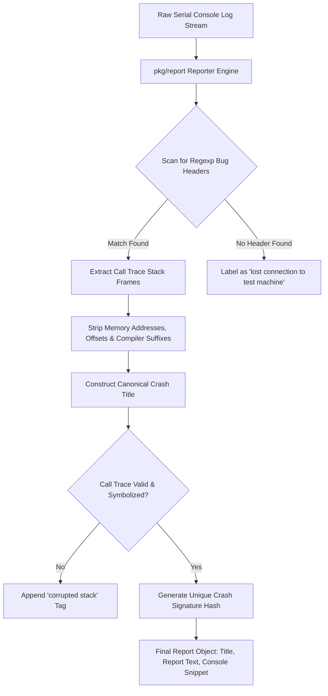

# Day 05: Crash Parsing & Deduplication Engine

⏱️ **Est. Reading Time**: 7–10 minutes (1119 words)

📂 **Key Source Files**: [`pkg/report/report.go`](../pkg/report/report.go), [`pkg/report/linux.go`](../pkg/report/linux.go)

---

## 1. Architectural Motivation & System Context

When a guest kernel crashes, panics, or triggers KASAN assertions, raw serial log output streams continuously to `syz-manager`. A single fuzzing run can generate thousands of crash logs containing mixed kernel console output, interleaved printk messages, and memory corruption reports.

The [`pkg/report`](../pkg/report/report.go) subsystem performs three critical tasks:
1. **Header Identification**: Scans raw console streams for kernel panic signatures (`BUG: KASAN`, `WARNING:`, `kernel BUG at`).
2. **Stack Frame Parsing**: Extracts faulting call stacks (`Call Trace:`) and sanitizes instruction offsets, memory addresses, and compiler suffixes.
3. **Canonical Title Generation**: Computes a canonical crash title hash (`Report.Title`) to de-duplicate crashes, ensuring that thousands of instances of the same bug are grouped under a single master bug report.



---

## 2. Core Data Structures (`Report` & `Reporter`)

In [`pkg/report/report.go`](../pkg/report/report.go), crash parsing revolves around the `Reporter` interface and `Report` struct:

```go
type Reporter interface {
    // ContainsReports checks if the log contains any known kernel crash headers.
    ContainsReports(output []byte) bool

    // Parse parses the raw console output stream and extracts all crash reports.
    Parse(output []byte) []*Report

    // Symbolize resolves raw frame addresses using vmlinux symbols.
    Symbolize(rep *Report) error
}

type Report struct {
    Title        string         // Canonical title (e.g., "KASAN: use-after-free Read in sys_read")
    Report       []byte         // Extracted stack trace snippet
    Output       []byte         // Full console log output surrounding the crash
    StartPos     int            // Offset where crash log starts in raw log
    EndPos       int            // Offset where crash log ends
    Category     Category       // Panic, KASAN, KMSAN, Lockup, Hang, etc.
    Frame        []StackFrame   // Parsed kernel stack frames
}

type StackFrame struct {
    Func   string // Normalized function name (e.g. "sys_read")
    File   string // Source file path (e.g. "fs/read_write.c")
    Line   int    // Source line number
    Inline bool   // True if inline frame
}
```

---

## 3. Regular Expression Pattern Matching (`pkg/report/linux.go`)

Linux kernel crash parsing uses compiled regular expression rules defined in [`pkg/report/linux.go`](../pkg/report/linux.go):

```go
// Pattern matching rule example for KASAN bugs
var kasanHeader = regexp.MustCompile(
    `BUG: KASAN: ([a-z-]+) (Read|Write) in ([a-zA-Z0-9_]+)`,
)

var callTraceHeader = regexp.MustCompile(
    `Call Trace:\s*\n((?:\s*\[<[0-9a-fA-F]+>\]\s*.*\n|\s*[\?a-zA-Z0-9_]+\+0x.*\n)+)`,
)
```

### Symbol Sanitization Rules
Raw stack trace lines contain noisy compiler artifacts:
```
[<ffffffff81204a10>] sys_read+0x12a/0x300 net/socket.c:124 [inline]
```
The sanitizer strips unwanted tokens:
1. Removes raw hex addresses (`[<ffffffff81204a10>]`).
2. Strips instruction offsets (`+0x12a/0x300`).
3. Strips compiler inline suffixes (`.constprop.0`, `.isra.0`).
4. Resulting clean frame: `sys_read net/socket.c:124`.

---

## 4. Title Generation Rules & Deduplication Logic

The canonical title determines how bugs are grouped:

```
[Crash Report Title Construction Strategy]
┌─────────────────────────┬─────────────────────────┬─────────────────────────┐
│ Bug Type Identifier     │ Fault Type              │ Faulting Function Name  │
│ "KASAN"                 │ "use-after-free Read"   │ "in sys_read"           │
└─────────────────────────┴─────────────────────────┴─────────────────────────┘
```

If two crash logs yield the exact same `Report.Title`, `syz-manager` treats them as instances of the **same underlying bug**, preventing bug tracker spamming.

---

## 💡 Dusty Corner of the Day

> [!TIP]
> **Corrupted Call Traces & `corrupted` Fallback Rules**:  
> Severe kernel memory corruption bugs (e.g., stack buffer overflows) can overwrite kernel stack frames, causing the unwinder to print garbage addresses or empty traces.  
> If `pkg/report` detects a crash header (`BUG: KASAN`) but fails to parse any valid function frames from the `Call Trace:`, it automatically appends the suffix `(corrupted)` to the crash title (e.g., `KASAN: use-after-free Read in unknown (corrupted)`).  
> This preserves the crash notification while isolating corrupted unwinder traces from cleanly parsed stack traces!

> [!NOTE]
> **Interleaved Printk Console Filtering**:  
> In multi-core SMP guest kernels, multiple CPU cores print log lines concurrently. `pkg/report/linux.go` detects CPU ID prefixes (`CPU: 2 PID: 4012`) to demux interleaved log lines back into coherent single-thread stack traces!

---

## 🔍 Deep Dive Code Reference (Optional)

<details>
<summary>View Complete `Parse` Matching Loop in `pkg/report/linux.go`</summary>

```go
// Inside pkg/report/linux.go
func (reporter *linux) Parse(output []byte) []*Report {
    var reports []*Report
    
    // Scan raw output line by line for registered crash patterns
    for pos := 0; pos < len(output); {
        match := reporter.findHeader(output[pos:])
        if match == nil {
            break
        }
        
        rep := &Report{
            StartPos: pos + match.Start,
            EndPos:   pos + match.End,
            Output:   output[pos + match.Start : pos + match.End],
        }
        
        // Extract stack frames and construct canonical title
        rep.Frame = reporter.parseStack(rep.Output)
        rep.Title = reporter.formatTitle(match, rep.Frame)
        
        reports = append(reports, rep)
        pos += match.End
    }
    
    return reports
}
```
</details>

---


## 5. Multi-Sanitizer Report Parsing (KASAN, KMSAN, KCSAN)

Different Linux kernel sanitizers output distinct bug headers and error reports:
- **KASAN Reports**: Identify `use-after-free`, `slab-out-of-bounds`, `global-out-of-bounds`, or `null-ptr-deref`.
- **KMSAN Reports**: Identify `uninit-value` errors, tracing uninitialized memory origin stacks back to initial kernel allocations.
- **KCSAN Reports**: Identify `data-race` conditions, displaying concurrent read/write stack traces on dual CPU cores.
- **Lockdep Reports**: Identify `possible circular locking dependency detected` warnings, parsing lock dependency graphs.

---


## 6. Inline Code Inspection: Stack Frame Sanitization & Regex Parser

Let's examine how `pkg/report/linux.go` parses console logs:

```go
// pkg/report/linux.go - Log parser snippets
type linux struct {
    kasanRe     *regexp.MustCompile
    panicRe     *regexp.MustCompile
    callTraceRe *regexp.MustCompile
}

func (reporter *linux) parseFrame(line string) *StackFrame {
    // Input line: "[<ffffffff81204a10>] sys_read+0x12a/0x300 net/socket.c:124"
    line = stripHexAddresses(line) // -> "sys_read+0x12a/0x300 net/socket.c:124"
    line = stripOffsets(line)      // -> "sys_read net/socket.c:124"
    
    parts := strings.Split(line, " ")
    return &StackFrame{
        Func: parts[0],
        File: parts[1],
    }
}
```

### Crash Title Construction Example
- **KASAN Log**: `BUG: KASAN: use-after-free Read in sys_read`
- **Parsed Frames**: `sys_read net/socket.c:124`, `vfs_read fs/read_write.c:456`
- **Generated Title**: `KASAN: use-after-free Read in sys_read`
- **Hash Signature**: `SHA256("KASAN: use-after-free Read in sys_read")`

---

## ✅ Daily Summary

1. `pkg/report` parses unstructured raw serial console logs, extracting stack frames and sanitizing memory addresses.
2. Canonical crash titles (`Report.Title`) serve as the deduplication key for grouping thousands of crash logs under a single master bug report.
3. Unwinder failures during severe memory corruption automatically receive `(corrupted)` title tags to prevent unparseable stack traces from polluting clean bug categories.
