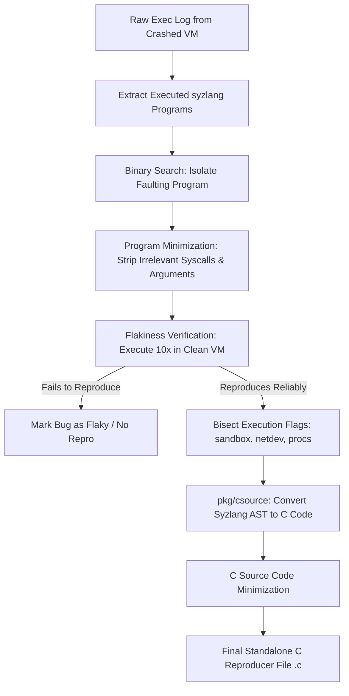

# Day 06: Automated Reproducer Pipeline

⏱️ **Est. Reading Time**: 7–10 minutes (1106 words)

📂 **Key Source Files**: [`pkg/repro/repro.go`](../pkg/repro/repro.go), [`pkg/csource/csource.go`](../pkg/csource/csource.go), [`pkg/repro/repro.go`](../pkg/repro/repro.go)

---

## 1. Architectural Motivation & System Context

When a kernel panic occurs, `syz-manager` has a raw execution log containing hundreds of system calls executed across multiple threads. However, submitting a noisy 500-line execution log to kernel developers is unhelpful.

The **Reproducer Subsystem** ([`pkg/repro`](../pkg/repro/repro.go)) distills noisy execution logs down to a minimal, standalone, zero-dependency C program (`.c`) that reliably reproduces the crash in a clean VM environment.



---

## 2. The 5 Stages of Reproducer Generation (`pkg/repro`)

The entry point `repro.Run()` executes five sequential transformation phases:

```go
type Result struct {
    Prog     *prog.Prog      // Minimized syzlang program AST
    Duration time.Duration   // Time taken to reproduce crash
    Opts     csource.Options // Required execution flags (sandbox, procs, etc.)
    CRepro   []byte          // Generated standalone C code bytes
}
```

### Stage 1: Log Parsing & Program Isolation
Extracts all candidate `prog.Prog` execution blocks preceding the panic. If multiple concurrent threads were executing, `pkg/repro` uses binary search to eliminate non-faulting program blocks.

### Stage 2: Program Minimization (`prog.Minimize`)
Iteratively strips system calls and shrinks buffer arguments:
1. **Syscall Removal**: Attempts removing each syscall one by one. If the crash still reproduces, the call is permanently removed.
2. **Argument Simplification**: Replaces complex struct fields and large buffers with zero values (`0`, `NULL`).

### Stage 3: Flakiness & Stability Verification
Executes the minimized candidate program up to **10–20 times** in fresh VM instances. If the crash only occurs once out of 20 runs, it is flagged as a race condition or flaky reproducer.

### Stage 4: Environment Flag Bisection
Tests execution flag combinations to find the minimal required isolation setup:
- `sandbox=none` vs `sandbox=setuid` vs `sandbox=namespace`
- `threaded` (multithreaded execution enabled)
- `collide` (concurrent syscall execution)
- `netdev` (virtual network interface creation)

### Stage 5: C Source Code Generation ([`pkg/csource`](../pkg/csource/csource.go))
Translates the minimized syzlang program AST into clean, standard C code.

---

## 3. C Source Code Generation Mechanics (`pkg/csource`)

[`pkg/csource/csource.go`](../pkg/csource/csource.go) generates standalone C code with zero external dependencies:

```c
// Example generated C reproducer output structure
#define _GNU_SOURCE
#include <endian.h>
#include <fcntl.h>
#include <stdint.h>
#include <stdio.h>
#include <stdlib.h>
#include <string.h>
#include <sys/syscall.h>
#include <unistd.h>

long r[2];

int main(void) {
  // Set up mmap memory sandbox area
  syscall(__NR_mmap, 0x1f000000ul, 0x1000000ul, 3ul, 0x32ul, -1, 0ul);
  
  // Execute minimized syscall sequence
  r[0] = syscall(__NR_openat, 0xffffffffffffff9cul, "/dev/kvm", 0ul, 0ul);
  r[1] = syscall(__NR_ioctl, r[0], 0xae01ul, 0ul);
  
  return 0;
}
```

---

## 4. C Source Options Struct (`csource.Options`)

```go
type Options struct {
    Threaded      bool   // Use pthreads for concurrent syscall execution
    Collide       bool   // Run system calls in overlapping loops
    Repeat        bool   // Repeat execution infinitely in main loop
    Procs         int    // Number of parallel execution processes
    Sandbox       string // Sandbox mechanism ("none", "setuid", "namespace")
    Fault         bool   // Inject kernel memory allocation faults
    FaultCall     int    // Index of syscall where fault injection occurs
    FaultNth      int    // Nth memory allocation to fail
    NetInjection  bool   // Inject synthetic netdev/tun devices
    NetDevices    bool   // Initialize virtual ethernet pairs
}
```

---

## 💡 Dusty Corner of the Day

> [!TIP]
> **Syz Repro vs C Repro (The Timing Paradox)**:  
> Occasionally, syzkaller produces a valid **Syz Reproducer** (`.syz` execution script) but fails to generate a **C Reproducer** (`.c`)!  
> Why? Syzlang programs are executed by `syz-executor` using microsecond-precision IPC shared memory buffers and lock-free thread synchronizations.  
> When compiled into standard C code using standard POSIX `pthread` calls, slight nanosecond timing shifts can prevent race conditions (such as double-free bugs) from triggering, causing the C reproducer verification step to fail!

> [!NOTE]
> **Fault Injection Reproducers**:  
> If a bug requires kernel allocation failures (`CONFIG_FAULT_INJECTION`), `pkg/csource` injects `/proc/thread-self/make-it-fail` writes right before the faulting syscall, instructing the kernel to fail the exact $N$-th memory allocation!

---

## 🔍 Deep Dive Code Reference (Optional)

<details>
<summary>View Complete Reproducer Entry Routine (`repro.Run`)</summary>

```go
// Inside pkg/repro/repro.go
func Run(log []byte, cfg *mgrconfig.Config, reporter report.Reporter, vmPool *vm.Pool) (*Result, error) {
    // Stage 1: Extract programs from raw log
    progs := parseLog(log, cfg.Target)
    if len(progs) == 0 {
        return nil, fmt.Errorf("no programs extracted from crash log")
    }
    
    // Stage 2: Binary search to find faulting program
    faultingProg, opts := bisectProgs(progs, cfg, reporter, vmPool)
    
    // Stage 3: Minimize program system calls
    minimizedProg := minimizeProg(faultingProg, cfg, reporter, vmPool, opts)
    
    // Stage 4: Generate C source code
    cBytes, err := csource.Write(minimizedProg, opts)
    if err != nil {
        return nil, fmt.Errorf("failed to generate C repro: %v", err)
    }
    
    return &Result{
        Prog:   minimizedProg,
        Opts:   opts,
        CRepro: cBytes,
    }, nil
}
```
</details>

---


## 5. POSIX C Code Compilation & Header Injections

When `pkg/csource` emits C reproducer files, it includes portable header blocks:
- **Sandbox Namespaces**: Injects `unshare(CLONE_NEWNET | CLONE_NEWPID | CLONE_NEWIPC)` to isolate network interfaces and process IDs.
- **Socket Injections**: Emits synthetic socket initialization loops (`socket`, `bind`, `connect`, `sendto`) to trigger network driver paths.
- **Thread Synchronization**: Uses `pthread_create` and `pthread_barrier_t` to force precise multi-threaded race condition timing.

---


## 6. Inline Code Inspection: Syzlang-to-C Translation (`pkg/csource`)

Let's examine how `pkg/csource` translates syzlang AST structures into standalone C code:

```go
// pkg/csource/csource.go - C Source Code Emitter
func Write(p *prog.Prog, opts Options) ([]byte, error) {
    buf := new(bytes.Buffer)
    
    // 1. Emit standard C header includes
    buf.WriteString("#define _GNU_SOURCE
")
    buf.WriteString("#include <endian.h>
#include <fcntl.h>
#include <stdint.h>
")
    buf.WriteString("#include <stdio.h>
#include <stdlib.h>
#include <sys/syscall.h>

")
    
    // 2. Emit sandbox isolation setups
    if opts.Sandbox == "namespace" {
        buf.WriteString("static void setup_sandbox() {
")
        buf.WriteString("  unshare(CLONE_NEWNET | CLONE_NEWPID | CLONE_NEWIPC);
")
        buf.WriteString("}

")
    }
    
    // 3. Emit syscall execution loop
    buf.WriteString("int main() {
")
    buf.WriteString("  setup_sandbox();
")
    for _, call := range p.Calls {
        emitSyscall(buf, call)
    }
    buf.WriteString("  return 0;
}
")
    return buf.Bytes(), nil
}
```

---

## ✅ Daily Summary

1. The reproducer pipeline minimizes raw execution logs through binary search and argument simplification.
2. Stability verification runs candidate programs 10-20 times in fresh VMs to confirm bug reproducibility.
3. Syzlang ASTs are compiled into zero-dependency C source files using `pkg/csource`.
