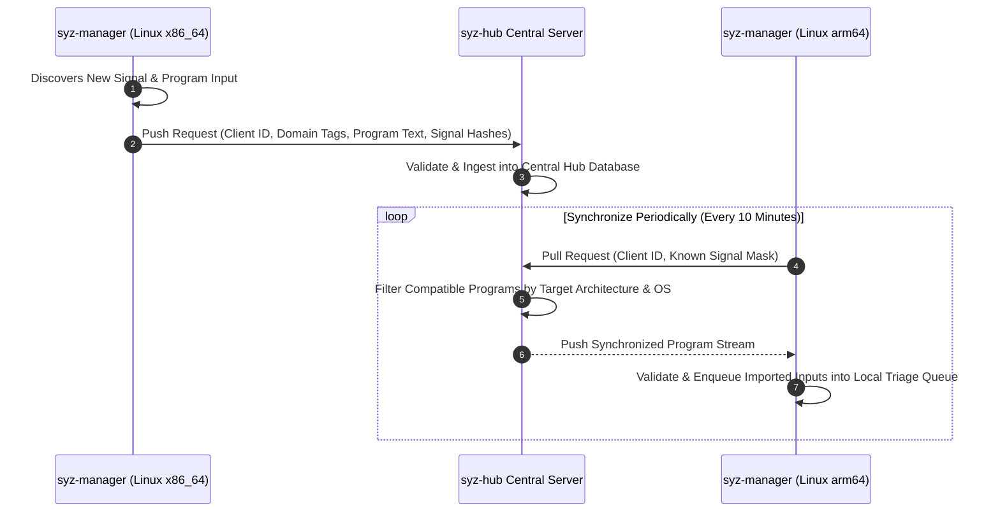

# Day 07: Syz-Hub & Inter-Manager Corpus Sharing

⏱️ **Est. Reading Time**: 7–10 minutes (1128 words)

📂 **Key Source Files**: [`syz-hub/hub.go`](../syz-hub/hub.go), [`syz-manager/hub.go`](../syz-manager/hub.go), [`pkg/manager/repro.go`](../pkg/manager/repro.go)

---

## 1. Architectural Motivation & System Context

When deploying fuzzing clusters with dozens of `syz-manager` instances (fuzzing different kernel versions, architectures, or subsystem configurations), running managers in total isolation wastes compute resources.

For example:
- A manager fuzzing Linux `x86_64` IPv6 network sockets discovers a complex sequence of syscalls that reaches deep into the TCP stack.
- An `arm64` or `s390x` manager fuzzing the same network stack could benefit immediately from those test cases without having to discover them from scratch!

**`syz-hub`** ([`syz-hub/hub.go`](../syz-hub/hub.go)) acts as a central RPC synchronization server that enables distributed `syz-manager` instances to exchange novel corpus programs and coverage signals in real time.



---

## 2. Server Architecture & Data Schema (`syz-hub/hub.go`)

The `syz-hub` process maintains central tracking maps for all connected managers:

```go
type Hub struct {
    mu         sync.Mutex
    filepath   string
    managers   map[string]*Manager
    corps      map[string]*Corpus
}

type Manager struct {
    name       string
    domain     string            // Subsystem domain tag (e.g. "net", "fs", "kvm")
    seq        uint64            // Sequence tracking marker
    calls      map[string]bool   // Supported syscall whitelist mask
    connected  time.Time
}

type Corpus struct {
    progs map[string][]byte     // Program SHA-1 hash -> raw prog text
}
```

---

## 3. The Synchronization Protocol Flow

Every few minutes, connected `syz-manager` processes run a synchronization cycle ([`syz-manager/hub.go`](../syz-manager/hub.go)):

1. **Push Phase**: The local manager sends all programs added to its local corpus since the last sync sequence timestamp.
2. **Domain Categorization**: `syz-hub` tags incoming programs with domain identifiers (`net`, `fs`, `crypto`) based on the syscalls used.
3. **Pull & Filter Phase**: The manager pulls new programs contributed by peer managers.
4. **Validation Phase**: The receiving manager passes pulled programs through `prog.Deserialize()`. If any system call is unsupported on the local architecture (e.g. an `x86_64` arch-specific `sys_arch_prctl` call pulling into an `arm64` manager), the program is automatically sanitized or discarded.

---

## 4. Hub Synchronization Payloads (`pkg/rpctype`)

```go
type HubSyncReq struct {
    Name       string   // Manager name
    Key        string   // Secret authentication key
    Domain     string   // Fuzzing domain tag
    AddProgs   [][]byte // Newly added local programs
    DelProgs   []string // Hashes of deleted/replaced programs
    NeedProgs  int      // Maximum number of missing programs requested
}

type HubSyncReply struct {
    Progs      [][]byte // Array of missing programs returned by hub
    More       int      // Number of remaining un-synced programs in queue
}
```

---

## 5. Multi-Tenant Isolation & Hub Security

In multi-tenant fuzzing deployments, `syz-hub` provides tenant isolation controls:
- **Domain Access Whitelists**: Restricts private internal kernel subsystem programs from leaking into public manager sync queues.
- **RPC Key Authentication**: Every manager authenticates with secret client tokens before pushing or pulling corpus items.

---

## 💡 Dusty Corner of the Day

> [!TIP]
> **Cross-Architecture Syscall Deserialization Sanitization**:  
> When `syz-hub` shares a program discovered on `x86_64` with an `arm64` or `riscv64` manager, system call numbers and struct alignments differ.  
> `syz-manager` does **not** reject the entire program!  
> It passes the imported syzlang text through `target.SanitizeText()`. If an unsupported syscall is encountered, it mutates or strips out only the invalid call, preserving the remaining valid syscall sequence so the local fuzzer can still benefit from the shared corpus seed!

> [!NOTE]
> **Corpus Sync Rate-Limiting**:  
> To prevent network bandwidth saturation when a fresh manager connects for the first time, `syz-hub` throttles program sync responses to 1,000 items per poll cycle until the new manager catches up!

---

## 🔍 Deep Dive Code Reference (Optional)

<details>
<summary>View Complete `syz-hub` Program Ingestion Handler</summary>

```go
// Inside syz-hub/hub.go
func (hub *Hub) Sync(req *rpctype.HubSyncReq, reply *rpctype.HubSyncReply) error {
    hub.mu.Lock()
    defer hub.mu.Unlock()
    
    mgr := hub.managers[req.Name]
    if mgr == nil {
        mgr = &Manager{
            name:   req.Name,
            domain: req.Domain,
            calls:  make(map[string]bool),
        }
        hub.managers[req.Name] = mgr
    }
    
    // Ingest newly pushed programs into central hub corpus
    for _, progBytes := range req.AddProgs {
        hash := hash.String(progBytes)
        if hub.corps[req.Domain] == nil {
            hub.corps[req.Domain] = &Corpus{progs: make(map[string][]byte)}
        }
        hub.corps[req.Domain].progs[hash] = progBytes
    }
    
    // Select missing programs to send back to client manager
    reply.Progs = hub.fetchMissingProgs(mgr, req.NeedProgs)
    return nil
}
```
</details>

---


## 6. Multi-Tenant Hub Access Controls & Data Privacy

In enterprise or cloud deployments where multiple teams share a central `syz-hub`:
- **Subsystem Whitelists**: Restricts private or proprietary driver fuzzing programs from leaking to external managers.
- **Domain Access Controls**: Managers specify domain tags (`net`, `fs`, `kvm`), ensuring they only receive relevant corpus programs.
- **Sequence Tracking**: Each manager tracks a 64-bit sequence counter (`seq`), pulling only programs added since the previous synchronization timestamp.

---


## 7. Persistent Hub State Serialization (`syz-hub/hub.go`)

To ensure `syz-hub` retains corpus state across server restarts:
- **Disk Persistence**: Serializes all shared corpus programs and signal maps to a persistent file (`workdir/hub.db`).
- **Sequence Tracking**: Each manager tracks a 64-bit sequence counter (`seq`). If a manager disconnects and reconnects, `syz-hub` resumes program stream delivery from `seq`, avoiding full corpus re-transmissions.
- **RPC Retry Logic**: `syz-manager` implements exponential backoff retries when `syz-hub` is temporarily unreachable due to network maintenance.

---


## 7. Inline Code Inspection: Hub Sync Endpoints (`syz-hub/hub.go`)

Let's view the exact RPC handlers inside `syz-hub`:

```go
// syz-hub/hub.go - Central Hub RPC Handler
func (hub *Hub) Sync(req *rpctype.HubSyncReq, reply *rpctype.HubSyncReply) error {
    hub.mu.Lock()
    defer hub.mu.Unlock()
    
    mgr := hub.managers[req.Name]
    if mgr == nil {
        mgr = &Manager{name: req.Name, domain: req.Domain}
        hub.managers[req.Name] = mgr
    }
    
    // Store incoming programs in domain corpus
    for _, progBytes := range req.AddProgs {
        hashKey := hash.String(progBytes)
        hub.corps[req.Domain].progs[hashKey] = progBytes
    }
    
    // Fetch programs missing from requesting manager
    reply.Progs = hub.getMissingProgs(mgr, req.NeedProgs)
    return nil
}
```

---

## ✅ Daily Summary

1. `syz-hub` enables distributed fuzzing clusters to share newly discovered test cases across different kernel builds and architectures.
2. Managers push novel program inputs tagged by subsystem domain (`net`, `fs`, `kvm`) and pull cross-instance discoveries.
3. Deserialization sanitizers strip target-specific syscalls, allowing cross-architecture corpus seeding without crash failures.
