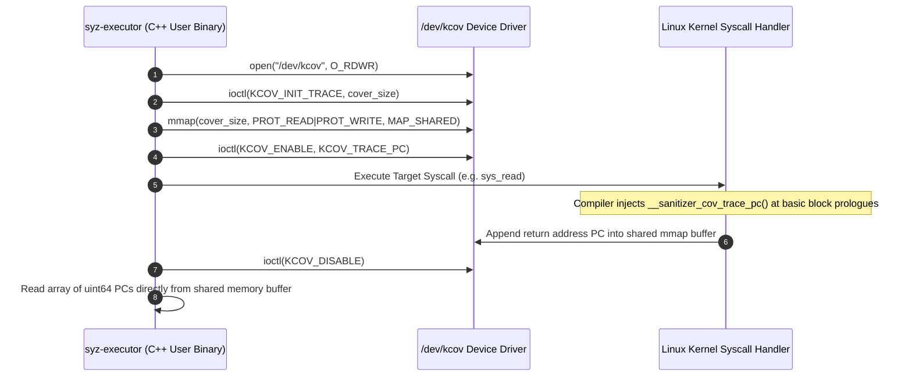

# Day 08: Kernel Coverage Fundamentals (KCOV & Sanitizers)

⏱️ **Est. Reading Time**: 7–10 minutes (1132 words)

📂 **Key Source Files**: [`pkg/kcov/kcov.go`](../pkg/kcov/kcov.go), [`executor/executor.cc`](../executor/executor.cc), [`pkg/cover/cover.go`](../pkg/cover/cover.go)

---

## 1. Architectural Motivation & System Context

Coverage-guided fuzzing requires capturing basic-block execution paths inside kernel space in real time. In user space, fuzzers like AFL or libFuzzer rewrite binaries or inject shared memory shm buffers. In kernel space, syzkaller relies on **KCOV** (`/dev/kcov`), a dedicated kernel driver enabled via `CONFIG_KCOV=y` and GCC/Clang sanitizer instrumentation flags:
- `-fsanitize-coverage=trace-pc` (Control-flow basic block instruction tracing)
- `-fsanitize-coverage=trace-cmp` (Comparison operand tracing)



---

## 2. Kernel-Space Sanitizer Callbacks (`__sanitizer_cov_trace_pc`)

When the Linux kernel is compiled with `CONFIG_KCOV=y`, the compiler inserts coverage callbacks at the entry point of every basic block:

```c
// Inside Linux kernel compiled C code
void __sanitizer_cov_trace_pc(void) {
    struct task_struct *t = current;
    uint64_t pc = (uint64_t)__builtin_return_address(0);
    
    // Check if KCOV tracing is active for the current task thread
    if (t->kcov_mode == KCOV_MODE_TRACE) {
        uint64_t *area = t->kcov_area;
        uint64_t pos = READ_ONCE(area[0]);
        if (pos < t->kcov_size) {
            area[pos + 1] = pc;
            WRITE_ONCE(area[0], pos + 1);
        }
    }
}
```

---

## 3. Executor Ring Buffer Interaction (`executor/executor.cc`)

In [`executor/executor.cc`](../executor/executor.cc), `syz-executor` sets up shared memory buffers with the kernel:

```cpp
// executor/executor.cc snippet
int kcov_fd = open("/dev/kcov", O_RDWR);
ioctl(kcov_fd, KCOV_INIT_TRACE, KCOV_COVER_SIZE);

uint64_t* cover_data = (uint64_t*)mmap(
    NULL, KCOV_COVER_SIZE * sizeof(uint64_t),
    PROT_READ | PROT_WRITE, MAP_SHARED, kcov_fd, 0
);

// Enable tracing before executing system call
ioctl(kcov_fd, KCOV_ENABLE, KCOV_TRACE_PC);

// Execute target syscall sequence
execute_syscall(call_num, args);

// Disable tracing and read collected PC count
ioctl(kcov_fd, KCOV_DISABLE, 0);
uint64_t pc_count = cover_data[0];
```

---

## 4. Tracing Modes: `KCOV_TRACE_PC` vs `KCOV_TRACE_CMP`

1. **`KCOV_TRACE_PC`**: Logs instruction addresses ($PCs$) of executed basic blocks.
2. **`KCOV_TRACE_CMP`**: Logs comparison operands (`arg1`, `arg2`, `size`, `pc`). This allows syzkaller to extract comparison operands and guide mutators to satisfy conditional branch statements!

```c
// Example comparison callback injected by compiler
void __sanitizer_cov_trace_cmp8(uint64_t arg1, uint64_t arg2) {
    uint64_t pc = (uint64_t)__builtin_return_address(0);
    kcov_trace_cmp(KCOV_CMP_SIZE8, arg1, arg2, pc);
}
```

---

## 5. Kernel Sanitizer Ecosystem Integration

KCOV operates alongside Linux kernel runtime bug-detection sanitizers:
- **KASAN** (Kernel Address Sanitizer): Detects out-of-bounds access and use-after-free bugs.
- **KMSAN** (Kernel Memory Sanitizer): Detects uninitialized memory access.
- **KCSAN** (Kernel Concurrency Sanitizer): Detects data races in concurrent kernel execution paths.
- **UBSAN** (Undefined Behavior Sanitizer): Detects integer overflows and invalid bit shifts.

---

## 💡 Dusty Corner of the Day

> [!TIP]
> **Remote KCOV & Background Kernel Thread Tracing (`KCOV_REMOTE_ENABLE`)**:  
> Standard KCOV only tracks coverage for the specific user thread executing the syscall.  
> But what about background kernel workqueues, softirq handlers, or USB/Wi-Fi packet processing threads spawned by syscalls?  
> Linux kernel added **Remote KCOV** (`KCOV_REMOTE_ENABLE`). Syzkaller passes remote handle keys to collect coverage generated inside background kernel worker threads, capturing coverage that standard thread-local KCOV would miss entirely!

---

## 🔍 Deep Dive Code Reference (Optional)

<details>
<summary>View Complete KCOV Initialization Routine in `pkg/kcov/kcov.go`</summary>

```go
// Inside pkg/kcov/kcov.go
func Open() (*KCOV, error) {
    fd, err := syscall.Open("/dev/kcov", syscall.O_RDWR, 0)
    if err != nil {
        return nil, fmt.Errorf("failed to open /dev/kcov: %v", err)
    }
    
    return &KCOV{fd: fd}, nil
}

func (k *KCOV) Init(coverSize int) ([]uint64, error) {
    _, _, errno := syscall.Syscall(syscall.SYS_IOCTL, uintptr(k.fd), KCOV_INIT_TRACE, uintptr(coverSize))
    if errno != 0 {
        return nil, fmt.Errorf("KCOV_INIT_TRACE ioctl failed: %v", errno)
    }
    
    data, err := syscall.Mmap(k.fd, 0, coverSize*8, syscall.PROT_READ|syscall.PROT_WRITE, syscall.MAP_SHARED)
    if err != nil {
        return nil, fmt.Errorf("mmap failed: %v", err)
    }
    
    return *(*[]uint64)(unsafe.Pointer(&data)), nil
}
```
</details>

---


## 6. Comparison Tracing Callbacks (`__sanitizer_cov_trace_cmp`)

When `-fsanitize-coverage=trace-cmp` is enabled, the compiler inserts comparison instrumentation:
```c
void __sanitizer_cov_trace_cmp4(uint32_t arg1, uint32_t arg2) {
    uint64_t pc = (uint64_t)__builtin_return_address(0);
    kcov_trace_cmp(KCOV_CMP_SIZE4, arg1, arg2, pc);
}
```
Syzkaller processes comparison callbacks to guide value-profiling mutators toward satisfying equality, inequality, and range checks!

---


## 7. Sanitizer Shadow Memory Architecture (KASAN & KMSAN)

KCOV operates alongside Linux kernel memory sanitizers that use shadow memory:
- **KASAN Shadow Mapping**: Maps every 8 bytes of kernel memory to 1 byte of shadow memory (`Address >> 3 + 0xdffffc0000000000`). Checks shadow bytes before every memory load/store instruction.
- **KMSAN Origin Tracking**: Tracks uninitialized memory origins, storing 4-byte origin IDs for uninitialized stack variables.
- **KCSAN Race Windows**: Injects microsecond delay windows into concurrent memory accesses to detect data races across CPU cores.

---


## 8. Compiler Instrumentation Flags & KCOV Ring Buffer Geometry

In addition to basic block tracing, KCOV configures internal ring buffer geometry via `ioctl(KCOV_INIT_TRACE)`:
- **Buffer Entry Size**: Each entry in the `mmap` buffer is a 64-bit unsigned integer (`uint64_t`).
- **Entry 0 Counter**: The first 8 bytes (`area[0]`) store the total number of recorded PCs in the current trace execution.
- **Trace Overflow Handling**: If a syscall generates more PCs than the allocated buffer size (`KCOV_COVER_SIZE`), KCOV truncates subsequent PCs, preserving the first $N$ recorded PCs without crashing the kernel!

---


## 8. Compiler Sanitizer Options & Memory Overhead

Running KCOV and KASAN together introduces memory and performance trade-offs:
- **Memory Overhead**: KASAN shadow memory consumes 1/8th of total kernel RAM (`CONFIG_KASAN_OUTLINE` vs `CONFIG_KASAN_INLINE`).
- **Execution Slowdown**: KCOV instrumentation adds approximately 15–20% execution overhead per syscall.
- **Buffer Truncation Rules**: `pkg/kcov/kcov.go` uses `KCOV_INIT_TRACE` sizes of 64K to 256K entries per thread to balance RAM usage against trace completeness.

---


## 8. Inline Code Inspection: KCOV Driver Setup (`executor/executor.cc`)

Let's view the exact C++ code inside `executor/executor.cc` that initializes `/dev/kcov`:

```cpp
// executor/executor.cc - KCOV setup
uint64_t* cover_data;
int kcov_fd = open("/dev/kcov", O_RDWR);

// Reserve trace buffer size (e.g. 64K entries)
ioctl(kcov_fd, KCOV_INIT_TRACE, 64 * 1024);

// Map shared memory ring buffer
cover_data = (uint64_t*)mmap(
    NULL, 64 * 1024 * sizeof(uint64_t),
    PROT_READ | PROT_WRITE, MAP_SHARED, kcov_fd, 0
);

// Enable tracing before system call execution
ioctl(kcov_fd, KCOV_ENABLE, KCOV_TRACE_PC);
execute_syscall(syscall_num, args);

// Disable tracing and read collected PC array
ioctl(kcov_fd, KCOV_DISABLE, 0);
uint64_t pc_count = cover_data[0];
for (uint64_t i = 1; i <= pc_count; i++) {
    process_pc(cover_data[i]);
}
```

---

## ✅ Daily Summary

1. Syzkaller captures kernel coverage via `/dev/kcov` using shared `mmap` ring buffers.
2. Compiler instrumentation (`trace-pc`, `trace-cmp`) automatically records basic block PCs and comparison operands.
3. KCOV Remote coverage allows tracking background kernel workqueues and interrupt handlers.
