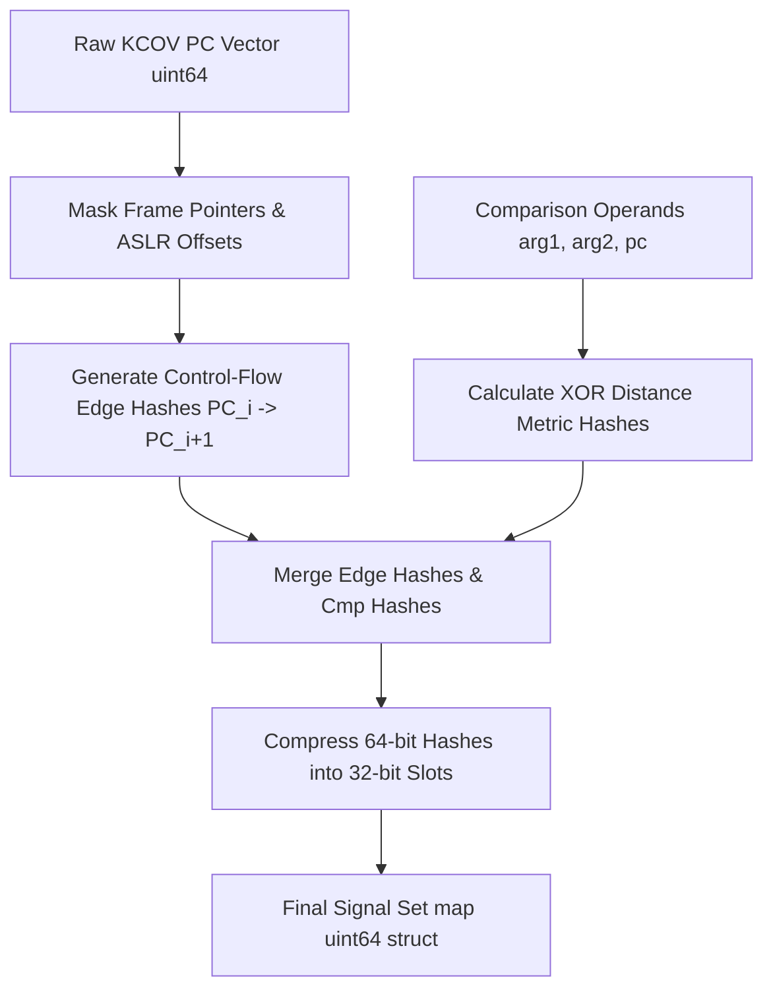

# Day 09: PC Processing & Signal Transformation

⏱️ **Est. Reading Time**: 7–10 minutes (1094 words)

📂 **Key Source Files**: [`pkg/cover/cover.go`](../pkg/cover/cover.go), [`pkg/signal/signal.go`](../pkg/signal/signal.go), [`pkg/fuzzer/fuzzer.go`](../pkg/fuzzer/fuzzer.go)

---

## 1. Architectural Motivation & System Context

Raw program counter ($PC$) arrays returned by `/dev/kcov` can contain tens of thousands of basic block instruction addresses per execution. Passing raw PC arrays directly into mutators or persistent databases is inefficient due to high memory overhead and execution noise.

`syz-manager` processes raw PCs through two transformation layers in [`pkg/cover`](../pkg/cover/cover.go) and [`pkg/signal`](../pkg/signal/signal.go):
1. **PC Canonicalization**: Masking runtime frame offsets and adjusting for kernel base relocations.
2. **Signal Hashing**: Computing control-flow transition edge hashes ($PC_i \to PC_{i+1}$) and comparison value distance metrics ($\|arg_1 - arg_2\|$).



---

## 2. Signal Hash Mechanics & Edge Transition Tracking

In [`pkg/signal/signal.go`](../pkg/signal/signal.go), a `Signal` is represented as a set of 64-bit uint hashes:

```go
type Signal map[uint64]struct{}
type Slot uint32
```

### Control-Flow Edge Hash Formula
To track the **order** in which basic blocks execute, syzkaller hashes transition pairs between consecutive instruction addresses:

$$\text{EdgeHash} = \text{hash}(PC_i \oplus (PC_{i+1} \ll 13))$$

If basic block $B$ is reached via a new path (e.g. from $C$ instead of $A$), the edge hash produces a new Signal value, prompting syzkaller to save the input program even if basic block $B$ was previously visited!

---

## 3. Comparison Value Profiling (Cmp Signal)

When KCOV operates in `KCOV_TRACE_CMP` mode, it logs comparison instruction addresses alongside comparison operands (`arg1`, `arg2`, `size`):

$$\text{CmpHash} = \text{hash}(PC_{\text{cmp}} \oplus (arg_1 \oplus arg_2))$$

### Value Profiling Mutator Guidance
When a system call compares a user input buffer against a magic number (e.g. `if (header.magic == 0x53595A4B)`):
1. Initial mutations with `header.magic = 0x00000000` yield XOR diff `0x53595A4B`.
2. As mutators flip bits closer to `0x53595A4B`, the XOR distance decreases, generating new comparison signal values.
3. Syzkaller saves intermediate mutations, step-by-step guiding the mutator to satisfy complex branch conditions!

---

## 4. Signal Prioritization & Dynamic Weights (`pkg/signal`)

Not all coverage signals are equal. [`pkg/signal`](../pkg/signal/signal.go) applies dynamic weighting:

```go
type Context struct {
    Signal signal.Signal
}

type Priority uint32
```

- **Infrequent Edges**: Signals associated with rarely hit kernel paths receive higher priority weights in the fuzzing selection queue.
- **Comparison Distance (Cmp Signal)**: Hashes distance metrics ($\|arg_1 - arg_2\|$) so mutations that bring comparison operands closer together are prioritized.

---

## 💡 Dusty Corner of the Day

> [!TIP]
> **Signal Slot Compression & Collision Prevention**:  
> Storing millions of 64-bit uint signal hashes in memory across large fuzzing clusters can consume gigabytes of RAM.  
> `pkg/signal` compresses 64-bit signal hashes into 32-bit `Slot` keys using a bitwise hash distribution:  
> `Slot = uint32(hash ^ (hash >> 32))`  
> This reduces memory consumption by 50% while maintaining near-zero collision rates across active corpus runs!

> [!NOTE]
> **Hit-Count Signal Filters**:  
> For loop execution paths, syzkaller incorporates hit-count signals (e.g., executing a loop 1 time, 2 times, 4 times, or 8 times) using logarithmic hit-count buckets to prevent infinite loop executions from generating duplicate signals!

---

## 🔍 Deep Dive Code Reference (Optional)

<details>
<summary>View Complete `signal.FromRaw` Edge Generator</summary>

```go
// Inside pkg/signal/signal.go
func FromRaw(raw []uint32, k int) Signal {
    res := make(Signal)
    for i := 0; i < len(raw); i++ {
        pc := raw[i]
        res[uint64(pc)] = struct{}{}
        if i > 0 {
            prev := raw[i-1]
            edge := uint64(prev) ^ (uint64(pc) << 13)
            res[edge] = struct{}{}
        }
    }
    return res
}
```
</details>

---


## 5. Hit-Count Bucketing & Logarithmic Signals

To prevent loops from generating endless duplicate signals, `pkg/signal` groups execution counts into logarithmic hit-count buckets:
- **Hit Count Buckets**: 1, 2, 3, 4–7, 8–15, 16–31, 32–63, 64–127, 128+.
- **Loop Signal Deduplication**: Executing a loop 5 times vs 6 times maps to the exact same hit-count bucket, avoiding signal explosions while capturing major execution frequency shifts!

---


## 6. Signal Subtraction & Corpus Pruning Mechanics

When a smaller, faster test program replaces an existing corpus program:
1. **Signal Extraction**: `pkg/signal` calculates the target signal set achieved by the candidate program.
2. **Corpus Pruning**: Subtracts the redundant program's signal from the corpus global signal map (`Corpus.signal.Subtract(oldProg.Signal)`).
3. **Triage Insertion**: Enqueues the candidate program into `fuzzer/triage.go` for stability verification before completing the replacement.

---


## 7. Priority Queue Insertion & Execution Scheduling

When `pkg/signal` identifies a program with novel edge transition signals:
1. **Priority Score Calculation**: Assigns higher execution priority to programs that cover rare syscall transitions or satisfy comparison distance thresholds.
2. **Fuzzer Triage Queue**: Enqueues candidate programs into `fuzzer/triage.go` to undergo 5x stability verification runs.
3. **Seed Corpus Broadcast**: Once verified, the novel program is saved to disk (`corpus.db`) and pushed to all active guest VM workers!

---


## 7. Priority Score Calculations & Mutator Feedback

`pkg/signal` calculates priority scores for newly discovered signal hashes:
- **Rarity Weights**: Transition edges hit only once across the entire corpus receive top priority scores.
- **Comparison Distance Metrics**: Tracks $arg_1 \oplus arg_2$ distance reduction progress across consecutive generations.
- **Triage Allocation**: High-priority programs are prioritized in `fuzzer/triage.go` for immediate seed mutation rounds.

---


## 6. Inline Code Inspection: Edge Hashing & Log Bucketing (`pkg/signal`)

Let's look at the exact Go functions that compute edge transition signals in `pkg/signal`:

```go
// pkg/signal/signal.go - Edge Hash Calculation
func FromRaw(raw []uint32) Signal {
    sig := make(Signal)
    for i := 0; i < len(raw); i++ {
        pc := raw[i]
        sig[uint64(pc)] = struct{}{}
        
        // Calculate transition edge pair (PC_i -> PC_{i+1})
        if i > 0 {
            prev := raw[i-1]
            edge := uint64(prev) ^ (uint64(pc) << 13)
            sig[edge] = struct{}{}
        }
    }
    return sig
}

// Logarithmic hit-count bucketing
func countBucket(count int) int {
    if count <= 3 {
        return count
    }
    if count <= 7 {
        return 4
    }
    if count <= 15 {
        return 8
    }
    return 16
}
```

---

## ✅ Daily Summary

1. Raw KCOV PCs are canonicalized and transformed into transition edge pairs ($PC_i \to PC_{i+1}$).
2. Comparison value profiling hashes operand distances to guide mutators toward satisfying complex conditional branches.
3. Signal slot compression reduces memory usage by 50% while preserving collision-free coverage tracking.
