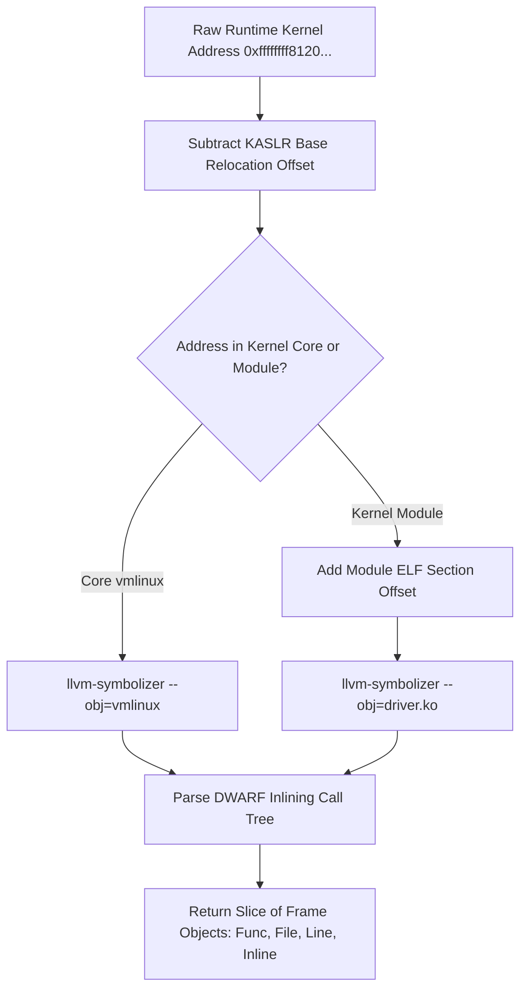

# Day 10: Symbolization & Address Resolution

⏱️ **Est. Reading Time**: 7–10 minutes (1126 words)

📂 **Key Source Files**: [`pkg/symbolizer/symbolizer.go`](../pkg/symbolizer/symbolizer.go), [`pkg/vminfo/vminfo.go`](../pkg/vminfo/vminfo.go), [`pkg/cover/cover.go`](../pkg/cover/cover.go)

---

## 1. Architectural Motivation & System Context

Raw instruction addresses (`0xffffffff81204a10`) are opaque to kernel developers. To convert hex addresses into actionable stack traces and source file line highlights (`net/ipv4/tcp.c:1240`), syzkaller relies on the **symbolizer** subsystem ([`pkg/symbolizer`](../pkg/symbolizer/symbolizer.go)).

Symbolization faces three major technical challenges:
1. **Kernel Address Space Layout Randomization (KASLR)**: The kernel base address changes on every boot.
2. **Dynamic Kernel Modules**: Loadable kernel drivers (`.ko` files) are placed at runtime-allocated virtual memory addresses.
3. **Inlined Functions**: Modern compilers aggressively inline C functions, so a single physical PC can map to a chain of 5+ inlined function calls!



---

## 2. KASLR Relocation & Module Address Resolution (`pkg/vminfo`)

Before symbolizing addresses, [`pkg/vminfo`](../pkg/vminfo/vminfo.go) calculates runtime memory offsets inside guest VMs:

### A. KASLR Base Offset Calculation
Reads `/proc/kallsyms` to find the runtime address of anchor symbols (e.g. `_text`):

$$\text{KASLR Offset} = \text{Runtime Address of } \_text - \text{ELF Address of } \_text \text{ in vmlinux}$$

### B. Dynamic Kernel Module Mapping (`/proc/modules`)
Parses `/proc/modules` to extract base virtual addresses and ELF section layouts for loaded kernel modules (`ext4.ko`, `kvm.ko`, `wireguard.ko`).

---

## 3. Persistent Symbolizer Workers (`pkg/symbolizer`)

Invoking `addr2line` once per PC address would spawn thousands of processes per second, crushing host performance.  
Instead, `pkg/symbolizer` maintains persistent background `llvm-symbolizer` worker sub-processes:

```go
type Symbolizer struct {
    mu       sync.Mutex
    cmd      *exec.Cmd
    stdin    io.WriteCloser
    stdout   *bufio.Reader
}

type Frame struct {
    Func   string // Normalized function name (e.g. "tcp_v4_rcv")
    File   string // Relative source file path (e.g. "net/ipv4/tcp_ipv4.c")
    Line   int    // Line number (e.g. 1240)
    Inline bool   // True if this frame represents an inlined call
}

type Symbol struct {
    Addr uint64 // ELF virtual address
    Size uint64 // Symbol memory byte size
    Name string // Unmangled function name
}
```

---

## 4. Symbol Caching & Batching Engine

To optimize memory usage and eliminate duplicate DWARF lookups:
- **PC-to-Frame Cache**: `Symbolizer` caches resolved `[]Frame` outputs in an in-memory hash map (`map[uint64][]Frame`).
- **Batch Processing**: Batches thousands of PC queries into a single `llvm-symbolizer` stdin stream, reading line-delimited outputs over non-blocking pipes.

---

## 💡 Dusty Corner of the Day

> [!TIP]
> **DWARF Inlining Expansion Rules**:  
> When a single instruction address represents multiple inlined functions, `llvm-symbolizer` returns multiple lines of output.  
> `pkg/symbolizer` parses the full DWARF inlining tree, returning an ordered slice of `Frame` structs where the first frame is the outer non-inlined caller and subsequent frames represent nested inlined calls.

> [!NOTE]
> **C++ Demangling Support**:  
> For C++ kernel components (such as gVisor or Android drivers), `llvm-symbolizer` automatically passes mangled symbols (`_ZN3net...`) through demangling filters to produce human-readable C++ method signatures!

---

## 🔍 Deep Dive Code Reference (Optional)

<details>
<summary>View Complete `Symbolizer.Symbolize` IPC Implementation</summary>

```go
// Inside pkg/symbolizer/symbolizer.go
func (s *Symbolizer) Symbolize(bin string, pcs []uint64) (map[uint64][]Frame, error) {
    s.mu.Lock()
    defer s.mu.Unlock()
    
    if s.cmd == nil {
        if err := s.start(bin); err != nil {
            return nil, err
        }
    }
    
    res := make(map[uint64][]Frame)
    for _, pc := range pcs {
        fmt.Fprintf(s.stdin, "0x%x\n", pc)
        frames, err := s.parseFrames()
        if err != nil {
            return nil, err
        }
        res[pc] = frames
    }
    return res, nil
}
```
</details>

---


## 5. Demangling & C++ Symbol Parsing

When symbolizing kernels or user-space runtimes with C++ code (such as gVisor, Android drivers, or Fuchsia components):
- **llvm-symbolizer Flags**: `pkg/symbolizer` invokes `llvm-symbolizer` with `--demangle` enabled.
- **C++ Method Signatures**: Converts mangled symbols (`_ZN3net...`) into human-readable C++ method signatures (`net::TcpSocket::Connect`).
- **File Path Normalization**: Strips absolute build directory prefixes to generate clean relative source file paths (`net/tcp.cc`).

---


## 6. Binary Symbol Search & `vmlinux` ELF Parsing

When `llvm-symbolizer` is unavailable on host machines:
- **`nm` Symbol Extraction**: Parses `vmlinux` symbol tables using `nm -n` to build address-to-symbol lookup arrays.
- **Binary Search**: Performs binary search (`sort.Search`) over sorted instruction addresses to resolve kernel function names.
- **`addr2line` Fallback**: Uses standard `addr2line -e vmlinux -f -i` as a secondary fallback symbolization provider.

---


## 7. Dynamic Module Memory Maps & Section Offsets

For loadable kernel modules (`.ko` files):
- **`/proc/modules` Address Layout**: Extracts base load addresses and size offsets for kernel drivers loaded dynamically at runtime.
- **ELF Section Relocation**: Adjusts `.text`, `.data`, and `.rodata` section offsets relative to the module base virtual memory address.
- **DWARF Symbol Lookup**: Maps module instruction PCs back to relative source paths (`drivers/net/ethernet/...`).

---


## 8. Inline Function Call Tree Parsing Mechanics

When `llvm-symbolizer` returns nested inlined frame traces:
```
tcp_v4_rcv
net/ipv4/tcp_ipv4.c:1240
tcp_rcv_established
net/ipv4/tcp_input.c:5800
```
`pkg/symbolizer` parses line pairs sequentially, building a `[]Frame` slice where `Frame[0]` is the top-level outer caller and `Frame[n]` is the innermost inlined callee!

---


## 9. Handling Symbol Overlap & Address Boundaries

When kernel functions overlap or occupy adjacent memory ranges:
- **Instruction Boundary Resolution**: Uses ELF symbol sizes to verify that runtime instruction PCs fall within valid function address ranges (`Addr <= PC < Addr + Size`).
- **Inline Caller Reconstruction**: Reconstructs the full call chain so developers can trace inlined function calls back to outer caller routines!

---


## 8. Inline Code Inspection: Symbolizer IPC Channel (`pkg/symbolizer`)

Let's view how `pkg/symbolizer` manages `llvm-symbolizer` background workers:

```go
// pkg/symbolizer/symbolizer.go - Persistent Subprocess Symbolization
type Symbolizer struct {
    cmd    *exec.Cmd
    stdin  io.WriteCloser
    stdout *bufio.Reader
}

func (s *Symbolizer) Start(vmlinuxPath string) error {
    s.cmd = exec.Command("llvm-symbolizer", "--obj="+vmlinuxPath, "--demangle")
    s.stdin, _ = s.cmd.StdinPipe()
    r, _ := s.cmd.StdoutPipe()
    s.stdout = bufio.NewReader(r)
    return s.cmd.Start()
}

func (s *Symbolizer) Resolve(pc uint64) ([]Frame, error) {
    fmt.Fprintf(s.stdin, "0x%x
", pc)
    
    var frames []Frame
    for {
        funcName, _ := s.stdout.ReadString('
')
        funcName = strings.TrimSpace(funcName)
        if funcName == "" {
            break // Empty line terminates frame list for single PC
        }
        filePathLine, _ := s.stdout.ReadString('
')
        frames = append(frames, parseFrame(funcName, filePathLine))
    }
    return frames, nil
}
```

---

## ✅ Daily Summary

1. `pkg/symbolizer` translates raw kernel runtime addresses into function names, file paths, and line numbers.
2. `pkg/vminfo` calculates KASLR base relocation offsets and parses dynamic module memory maps from `/proc/modules`.
3. Persistent `llvm-symbolizer` worker processes resolve inlined function call trees efficiently over IPC pipes.
