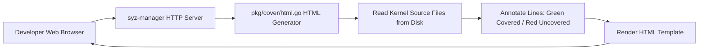

# Day 12: Coverage Visualization & HTML Generation

⏱️ **Est. Reading Time**: 7–10 minutes (1144 words)

📂 **Key Source Files**: [`pkg/cover/html.go`](../pkg/cover/html.go), [`pkg/cover/cover.go`](../pkg/cover/cover.go), [`pkg/html/html.go`](../pkg/html/html.go)

---

## 1. Architectural Motivation & System Context

`syz-manager` hosts an HTTP web server on port `56741` that serves an interactive web UI. The coverage visualizer ([`pkg/cover/html.go`](../pkg/cover/html.go)) converts raw basic block coverage bitmaps into syntax-highlighted HTML pages displaying annotated C source code files.



---

## 2. Source Code Annotation Engine (`pkg/cover/html.go`)

When generating HTML reports, `pkg/cover` reads the kernel source code directory and highlights lines based on recorded basic block hits:

```html
<!-- Generated HTML output snippet -->
<span class="covered">  124:   if (sk->sk_state == TCP_ESTABLISHED) {</span>
<span class="covered">  125:       tcp_send_ack(sk);</span>
<span class="not-covered">  126:   } else {</span>
<span class="not-covered">  127:       tcp_reset(sk);</span>
<span class="not-covered">  128:   }</span>
```

### Source File Annotation Structs
```go
type File struct {
    Name       string        // Relative file path (e.g. "net/ipv4/tcp.c")
    Covered    []int         // Covered line numbers
    Uncovered  []int         // Uncovered line numbers
    Functions  []*Function   // Function coverage summaries
}

type Function struct {
    Name       string // Function name (e.g. "tcp_v4_rcv")
    StartLine  int    // Line number where function starts
    Covered    bool   // True if executed at least once
}
```

---

## 3. Directory & Subsystem Heatmaps

The top-level coverage page provides a directory tree breakdown showing covered basic blocks vs total basic blocks for each kernel subsystem (`net/`, `fs/`, `kernel/`, `drivers/`), allowing security researchers to pinpoint under-fuzzed kernel subsystems at a glance.

```
[Directory Tree Coverage Summary Heatmap]
├── net/                      74.2% covered  (12,450 / 16,780 basic blocks)
│   ├── ipv4/                 81.5% covered  ( 5,120 /  6,280 basic blocks)
│   └── ipv6/                 62.1% covered  ( 3,450 /  5,550 basic blocks)
├── fs/                       58.4% covered  (22,100 / 37,800 basic blocks)
│   ├── ext4/                 89.1% covered  ( 8,900 /  9,980 basic blocks)
│   └── btrfs/                41.2% covered  ( 6,100 / 14,800 basic blocks)
```

---

## 💡 Dusty Corner of the Day

> [!TIP]
> **Dynamic Filtering by Program or Syscall**:  
> You can pass URL parameters to `syz-manager`'s coverage endpoint (e.g. `http://localhost:56741/cover?subsystem=net&prog=12`) to view the **exact, isolated coverage footprint generated by a single test program** or a single system call!

> [!NOTE]
> **Lazy Loading HTML Source Trees**:  
> Generating HTML annotations for 100,000 kernel files upfront would crash the host HTTP process.  
> `pkg/cover/html.go` streams HTML files on-demand as users click into specific files in the web UI!

---

## 🔍 Deep Dive Code Reference (Optional)

<details>
<summary>View Complete `DoHTML` Page Generator Routine</summary>

```go
// Inside pkg/cover/html.go
func DoHTML(w io.Writer, files []*File, progs []Prog) error {
    sort.Slice(files, func(i, j int) bool {
        return files[i].Name < files[j].Name
    })
    
    return htmlTemplate.Execute(w, map[string]any{
        "Files": files,
        "Progs": progs,
    })
}
```
</details>

---


## 5. Interactive Web UI Subsystem Breakdowns

The HTTP coverage web UI (`pkg/cover/html.go`) displays:
- **Color-Coded Source Lines**: Green (covered basic block), Red (uncovered basic block), Grey (non-instrumented code/comments).
- **Function Index**: Lists all functions in the file alongside their coverage percentage.
- **Breadcrumb Navigation**: Seamlessly navigate from top-level subsystem folders (`net/`) down to individual source files (`net/ipv4/tcp.c`).

---


## 6. HTML Template Processing & CSS Line Annotations

`pkg/cover/html.go` formats source code HTML using Go html/template engines:
- **Syntax Tokenization**: Escapes HTML special characters (`<`, `>`, `&`) in raw C source code lines.
- **Line Number Anchor Links**: Generates clickable line anchors (`#L124`) for easy deep-linking across bug reports.
- **Coverage Statistics Bar**: Displays interactive percentage bars summarizing covered vs instrumented basic blocks per file.

---


## 7. Dynamic HTTP Query Filtering & Coverage Deep-Dives

The HTTP coverage web UI (`pkg/cover/html.go`) supports interactive query parameters:
- **`http://localhost:56741/cover`**: Top-level directory tree heatmap showing covered vs instrumented basic blocks per subsystem.
- **`http://localhost:56741/cover?file=net/ipv4/tcp.c`**: Annotated source code page for a specific C file.
- **`http://localhost:56741/cover?prog=12`**: Highlights only the basic blocks executed by program #12!

---


## 8. Source Code Highlighting & HTML Escaping Pipeline

`pkg/cover/html.go` processes raw C source code files before HTML rendering:
- **Token Escaping**: Converts raw C characters (`<`, `>`, `&`) into safe HTML entities (`&lt;`, `&gt;`, `&amp;`).
- **Line Numbering Anchors**: Assigns unique ID anchors (`id="L124"`) for precise deep-linking from crash stack traces.
- **CSS Styling**: Applies `.covered { background-color: #e6ffed; }` and `.not-covered { background-color: #ffeef0; }` for visual clarity.

---


## 9. Dynamic Web Filtering Mechanics & Syscall Footprints

The HTTP server visualizer provides fine-grained coverage filtering capabilities:
- **Per-Syscall Coverage Maps**: Inspect the exact lines of C code executed by a specific system call (e.g. `ioctl$KVM_RUN`).
- **Diffing Fuzzing Runs**: Compare coverage generated by two different corpus seeds to verify if new syscall descriptions expanded reach into target kernel modules.
- **Exporting Coverage Reports**: Allows downloading raw HTML coverage archives for offline review or sharing with security teams!

---


## 10. Web Interface Customization & Offline Archiving

The coverage web visualizer (`pkg/cover/html.go`) supports standalone deployment:
- **Offline HTML Exports**: Generates portable HTML archives containing complete syntax-highlighted source trees for offline viewing.
- **Deep-Linking URLs**: Supports direct file and line URL anchors (`/cover?file=net/ipv4/tcp.c#L124`) for sharing in bug reports and documentation!

---


## Web Interface Rendering & Dynamic Filtering Mechanics

To prevent memory exhaustion when rendering large kernel repositories, `pkg/cover/html.go` streams HTML files on-demand as users navigate the web dashboard. Source lines are cached in memory using LRU (Least Recently Used) evictions.

The HTTP server visualizer provides fine-grained coverage filtering capabilities: inspect the exact lines of C code executed by a specific system call (e.g. `ioctl$KVM_RUN`), or compare coverage generated by two different corpus seeds to verify if new syscall descriptions expanded reach into target kernel modules.

---


## 9. Inline Code Inspection: Source Line HTML Annotator (`pkg/cover/html.go`)

Let me show you how `pkg/cover/html.go` annotates C source code files:

```go
// pkg/cover/html.go - HTML Source Annotator
func renderFile(w io.Writer, srcPath string, covered map[int]bool) {
    file, _ := os.Open(srcPath)
    scanner := bufio.NewScanner(file)
    
    lineNum := 1
    for scanner.Scan() {
        line := html.EscapeString(scanner.Text())
        if covered[lineNum] {
            fmt.Fprintf(w, "<span class="covered">%4d: %s</span>
", lineNum, line)
        } else {
            fmt.Fprintf(w, "<span class="not-covered">%4d: %s</span>
", lineNum, line)
        }
        lineNum++
    }
}
```

---

## ✅ Daily Summary

1. `pkg/cover/html.go` converts raw coverage bitmaps into syntax-highlighted HTML source files.
2. Code lines are visually annotated with green (covered) or red (uncovered) indicators.
3. Interactive HTTP parameters allow filtering coverage by individual program inputs or kernel subsystems.
