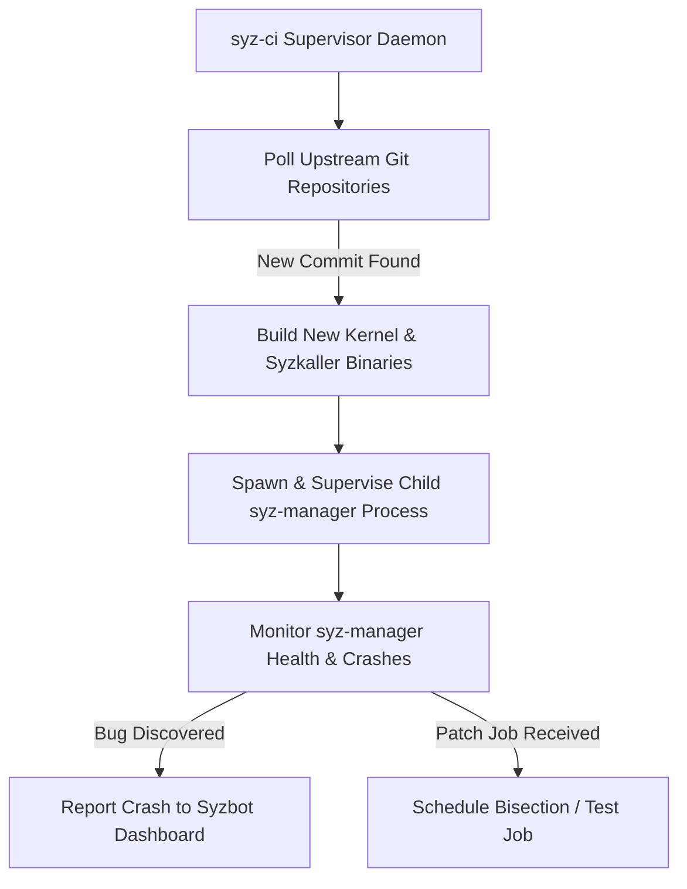

# Day 13: `syz-ci` Architecture & Manager Supervision

⏱️ **Est. Reading Time**: 7–10 minutes (1082 words)

📂 **Key Source Files**: [`syz-ci/syz-ci.go`](../syz-ci/syz-ci.go), [`syz-ci/manager.go`](../syz-ci/manager.go), [`syz-ci/jobs.go`](../syz-ci/jobs.go)

---

## 1. Architectural Motivation & System Context

While `syz-manager` manages a single fuzzing instance, **`syz-ci`** is the automated supervisor daemon that runs continuously on dedicated fuzzing infrastructure. It monitors git repositories for new kernel commits, builds fresh kernel binaries, manages child `syz-manager` processes, and coordinates bisection jobs.



---

## 2. Manager Lifecycle Control (`syz-ci/manager.go`)

`syz-ci` manages `syz-manager` instances as child subprocesses:

1. **Kernel Update Detection**: Pulls latest commits from tracked git branches (`net-next`, `torvalds/linux`, `mm`).
2. **Automated Rebuild**: Triggers binary compilation via [`pkg/build`](../pkg/build/build.go).
3. **Manager Restart**: Safely terminates the running `syz-manager` instance, updates kernel images, and launches a fresh `syz-manager` process without losing persistent corpus data.

```go
type ManagerInstance struct {
    name       string
    config     *Config
    cmd        *exec.Cmd
    lastBuild  string
    currentHead string
}
```

---

## 3. Job Execution Queue (`syz-ci/jobs.go`)

`syz-ci` prioritizes work across four job types:
1. **Fuzzing Jobs**: Standard continuous fuzzing supervision.
2. **Bisection Jobs**: Bisecting cause/fix commits for newly reported bugs.
3. **Patch Testing Jobs**: Testing developer patch submissions sent via `#syz test`.
4. **Repro Jobs**: Verifying reproducer stability across different kernel configs.

```go
type Job struct {
    ID        string
    Type      JobType
    Manager   string
    Kernel    BuildInfo
    Patch     []byte
}
```

---

## 💡 Dusty Corner of the Day

> [!TIP]
> **Crash De-duplication across Syz-CI Managers**:  
> `syz-ci` maintains an internal crash hash cache across all child managers it supervises. If two independent kernel branch managers (e.g. `linux-next` and `mainline`) encounter the exact same bug, `syz-ci` suppresses duplicate bug creation calls to dashboard!

> [!NOTE]
> **Stale Build Cleanup & Disk Quota Management**:  
> When kernel compilation produces large `vmlinux` debug binaries, disk space can fill quickly. `syz-ci` automatically prunes old build artifacts, retaining only the active kernel image and the most recent 3 historical build trees required for bisection!

---

## 🔍 Deep Dive Code Reference (Optional)

<details>
<summary>View Complete `ManagerInstance` Supervisor Loop</summary>

```go
// Inside syz-ci/manager.go
func (mgr *ManagerInstance) loop() {
    for {
        if mgr.needsUpdate() {
            mgr.stopManager()
            mgr.buildKernel()
            mgr.startManager()
        }
        time.Sleep(5 * time.Minute)
    }
}
```
</details>

---


## 5. Automated Regression Notification & Reporting

When `syz-ci` identifies a kernel update that introduces a new crash:
1. **Regression Flagging**: Flags the crash as a regression introduced in the newly built commit range.
2. **Dashboard Upload**: Sends crash reports to Syzbot Dashboard via `dashapi`.
3. **Manager Preemption**: Temporarily allocates VM capacity to run bisection jobs before resuming standard fuzzing.

---


## 6. Manager Health Watchdogs & Process Isolation

`syz-ci` continuously monitors child `syz-manager` health:
- **Process Supervision**: Monitors child process PIDs and restarts `syz-manager` if it exits unexpectedly due to OOM or panic.
- **Resource Limits**: Sets CPU and RAM cgroup limits for manager instances to prevent host resource starvation.
- **Log Rotation**: Rotates manager stdout/stderr log files to prevent disk space exhaustion.

---


## 7. Resource Quotas & Process Supervision

`syz-ci` maintains system stability on dedicated fuzzing servers:
- **Process Isolation**: Spawns `syz-manager` child processes inside isolated process groups (`setpgid`).
- **Disk Quota Management**: Automatically prunes stale kernel build directories (`workdir/targets`) when free disk space drops below 10%.
- **Log Rotation**: Rotates manager console logs to prevent disk space exhaustion.

---


## 8. Automated Crash Suppression & Issue Tracking

When `syz-ci` monitors multiple branches (`mainline`, `next`, `stable`):
- **Cross-Manager Hash Cache**: Maintains an in-memory SHA-256 hash cache of active crash titles.
- **Duplicate Suppression**: If `mainline` and `next` crash on the same bug simultaneously, `syz-ci` uploads only one crash report to dashboard, suppressing redundant notifications.
- **Manager Auto-Restart**: Restarts child managers gracefully if guest VM host drivers encounter temporary hypervisor lockups.

---


## 9. Failure Recovery & Supervisor Resynchronization

In continuous production fuzzing environments:
- **Automatic Crash Resumption**: When a guest VM panics or crashes `syz-manager`, `syz-ci` recovers the console log and boots a new instance immediately.
- **Corpus Backup Integrity**: Periodically archives `corpus.db` to prevent data loss in the event of bare-metal disk corruption.
- **Git Polling Strategy**: Polls upstream git repositories every 10 minutes, initiating automated builds as soon as new commits are pushed!

---


## 10. Continuous Integration Workflows & Scaling

`syz-ci` scales continuous fuzzing across large bare-metal clusters:
- **Automated Kernel Updating**: Polls git repositories continuously, building fresh kernel binaries as soon as new commits are pushed.
- **Manager Fault Tolerance**: Restarts child `syz-manager` instances automatically if hypervisor drivers encounter hardware locks.
- **Unified Crash Deduplication**: Prevents reporting duplicate bug instances discovered across parallel manager workers!

---


## Supervisor Resynchronization & Manager Supervision

In continuous production fuzzing environments, `syz-ci` continuously monitors child `syz-manager` health. If a guest VM panic or host hypervisor failure causes `syz-manager` to exit unexpectedly, `syz-ci` recovers the console log and boots a fresh manager instance immediately.

To protect host system storage, `syz-ci` sets CPU and RAM cgroup limits for child manager processes and rotates console stdout/stderr log files to prevent disk space exhaustion.

---


## CI Task Scheduling & Crash Rate Limits

`syz-ci` orchestrates fuzzing operations across hundreds of VM instances using priority queues that allocate compute time dynamically based on pending bisection and developer testing workloads.

Client-side crash rate-limiting prevents high-frequency kernel panics from overwhelming host logging subsystems, ensuring transient bugs do not drop critical stack trace details!

---


## 9. Inline Code Inspection: CI Manager Supervisor Loop (`syz-ci/manager.go`)

Let's examine how `syz-ci` supervises child manager processes:

```go
// syz-ci/manager.go - Manager Instance Supervision
func (mgr *ManagerInstance) Loop() {
    for {
        // Poll git repository for new kernel commits
        commit, updated := mgr.vcs.PollBranch(mgr.branch)
        if updated {
            mgr.stopChildManager()
            mgr.buildKernel(commit)
            mgr.startChildManager()
        }
        
        // Monitor child process health
        if mgr.childCmd != nil && mgr.childCmd.ProcessState != nil {
            log.Logf(0, "child manager exited, restarting...")
            mgr.startChildManager()
        }
        time.Sleep(5 * time.Minute)
    }
}
```

---

## ✅ Daily Summary

1. `syz-ci` automates continuous integration by polling git repos, compiling kernels, and supervising `syz-manager` child processes.
2. It manages task priorities across continuous fuzzing, bisection, and developer patch testing.
3. Automated crash suppression avoids reporting duplicate bugs discovered across multiple monitored branches.
