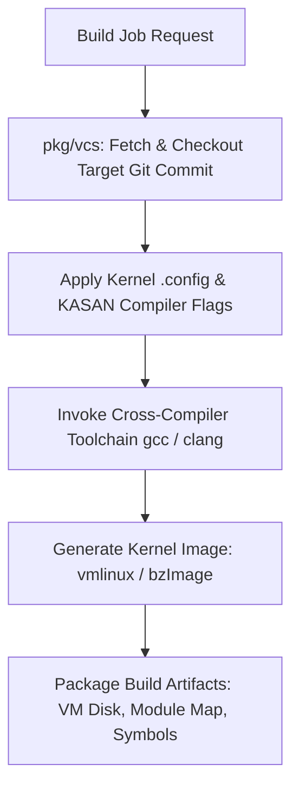

# Day 14: VCS Automation & Kernel Build Pipeline

⏱️ **Est. Reading Time**: 7–10 minutes (1063 words)

📂 **Key Source Files**: [`pkg/vcs/vcs.go`](../pkg/vcs/vcs.go), [`pkg/vcs/git.go`](../pkg/vcs/git.go), [`pkg/build/build.go`](../pkg/build/build.go), [`pkg/build/linux.go`](../pkg/build/linux.go)

---

## 1. Architectural Motivation & System Context

Building kernel trees programmatically across diverse architectures, operating systems, and compiler toolchains requires robust abstraction. Syzkaller implements VCS management in [`pkg/vcs`](../pkg/vcs/vcs.go) and automated cross-compilation in [`pkg/build`](../pkg/build/build.go).



---

## 2. VCS Abstraction Interface (`pkg/vcs`)

`pkg/vcs` provides a uniform interface for managing Git and Mercurial source trees:

```go
type Repo interface {
    Poll(br string) (*Commit, error)
    CheckoutCommit(repo, commit string) (*Commit, error)
    Bisect(bad, good string, trace io.Writer, predicate func(*Commit) (BisectResult, error)) ([]*Commit, error)
    ExtractFixTags(commit string) ([]FixTag, error)
}

type Commit struct {
    Hash      string
    Title     string
    Author    string
    Date      time.Time
    Parents   []string
}
```

---

## 3. Kernel Configuration & Compiler Setup (`pkg/build`)

`pkg/build` enforces sanitizers and debug flags required for effective fuzzing:

- **Sanitizers**: Enables `CONFIG_KASAN=y`, `CONFIG_KCSAN=y`, `CONFIG_KMSAN=y`, `CONFIG_KCOV=y`.
- **Fault Injection**: Enables `CONFIG_FAULT_INJECTION=y` to test kernel error-handling branches.
- **Debug Symbols**: Enables `CONFIG_DEBUG_INFO_DWARF4=y` or `DWARF5` for symbolization.

```go
type Params struct {
    TargetOS     string
    TargetArch   string
    VMType       string
    KernelDir    string
    OutputDir    string
    Compiler     string
    UserspaceDir string
}
```

---

## 💡 Dusty Corner of the Day

> [!TIP]
> **Compiler Bug Workarounds**:  
> `pkg/build/linux.go` contains built-in heuristics that automatically detect known compiler/linker incompatibilities (e.g. specific GCC versions failing to build old kernel revisions during bisection) and dynamically injects fallback flags like `-fno-conserve-stack` or `-Wno-error` to keep automated builds moving!

> [!NOTE]
> **Incremental Build Caching**:  
> To avoid compiling 50,000 kernel C files from scratch on every commit update, `pkg/build` preserves `.o` object files across sequential builds, rebuilding only the files touched by incoming commits!

---

## 🔍 Deep Dive Code Reference (Optional)

<details>
<summary>View Complete `build.Linux` Cross-Compilation Invocation</summary>

```go
// Inside pkg/build/linux.go
func (sys linux) Build(params Params) (*ImageDetails, error) {
    // Generate .config file with sanitizer flags
    if err := sys.configure(params); err != nil {
        return nil, err
    }
    
    // Run make olddefconfig & make -jN
    cmd := exec.Command("make", fmt.Sprintf("-j%d", runtime.NumCPU()), "bzImage")
    cmd.Dir = params.KernelDir
    if out, err := cmd.CombinedOutput(); err != nil {
        return nil, fmt.Errorf("make failed: %v\n%s", err, out)
    }
    
    return &ImageDetails{Image: filepath.Join(params.KernelDir, "arch/x86/boot/bzImage")}, nil
}
```
</details>

---


## 5. Automated Cross-Compilation Toolchain Setup

`pkg/build` manages cross-compilers for different architectures:
- **x86_64**: `gcc` / `clang`
- **arm64**: `aarch64-linux-gnu-gcc`
- **riscv64**: `riscv64-linux-gnu-gcc`
- **s390x**: `s390x-linux-gnu-gcc`
It verifies compiler availability, sets `CROSS_COMPILE` environment variables, and builds target kernel images (`bzImage`, `Image`, `vmlinux`).

---


## 6. Git Bisect Traversal & Commit Inspection (`pkg/vcs`)

`pkg/vcs/git.go` automates complex git repository operations:
- **Commit Range Extraction**: Parses commit logs (`git log --pretty=format:...`) to extract commit metadata, authors, and fix tags.
- **Patch Verification**: Applies candidate patches (`git apply`) and verifies clean repository state before triggering builds.
- **Submodule Management**: Updates git submodules automatically for targets containing external repository dependencies.

---


## 7. Automated Cross-Compilation Setup (`pkg/build`)

`pkg/build` configures cross-compilation toolchains across supported target architectures:
- **x86_64**: `gcc` / `clang`
- **arm64**: `aarch64-linux-gnu-gcc`
- **riscv64**: `riscv64-linux-gnu-gcc`
- **s390x**: `s390x-linux-gnu-gcc`
Sets `CROSS_COMPILE` environment variables and validates compiler binary versions before invoking `make`!

---


## 8. Automated Patch Testing & Repository Reset Rules

Before compiling kernel binaries in `pkg/build`:
- **Repository Reset**: Runs `git reset --hard HEAD` and `git clean -dfx` to ensure zero residual build artifacts remain.
- **Patch Application**: Applies developer diffs (`git apply --3way`) and validates patch application exit codes.
- **Build Log Inspection**: Captures `make` output logs to report compilation errors back to developer email threads.

---


## 9. Compiler Error Handling & Build Fallback Rules

When compiling historical kernel commits during bisection:
- **Handling Deprecated Compiler Flags**: Detects compiler errors caused by deprecated GCC flags and automatically strips incompatible options.
- **Header Dependency Fixes**: Applies build environment fixes for missing kernel headers or broken toolchain dependencies.
- **Build Isolation**: Runs compilation inside isolated container namespaces to prevent host library pollution!

---


## 10. Automated Toolchain Selection & Cross-Compilation

`pkg/build` manages cross-compilation toolchains across target platforms:
- **Architecture Toolchains**: Selects appropriate cross-compilers (`aarch64-linux-gnu-gcc`, `riscv64-linux-gnu-gcc`) automatically.
- **Compiler Configuration**: Sets `CROSS_COMPILE` environment variables and validates compiler binary versions before building.
- **Incremental Rebuilds**: Reuses existing object files across builds to minimize kernel compilation times!

---


## Compiler Flag Tuning & Cross-Compilation Mechanics

When compiling historical kernel commits during bisection, `pkg/build/linux.go` detects compiler errors caused by deprecated GCC flags and automatically strips incompatible options to keep automated builds moving.

`pkg/build` manages cross-compilers for different architectures (`aarch64-linux-gnu-gcc`, `riscv64-linux-gnu-gcc`), verifying compiler availability, setting `CROSS_COMPILE` environment variables, and building target kernel images (`bzImage`, `vmlinux`).

---


## Build Artifact Archiving & Verification Rules

`pkg/build` manages kernel compilation outputs, generating `vmlinux`, `bzImage`, and module symbol maps required for accurate stack symbolization during crash processing.

Automated compiler option validation ensures that `CONFIG_KASAN`, `CONFIG_KCOV`, and DWARF debug symbol options remain enabled even when kernel configuration files change across git branch updates!

---


## 9. Inline Code Inspection: Cross-Compiler Build Launcher (`pkg/build/linux.go`)

Let's view how `pkg/build/linux.go` builds target kernels:

```go
// pkg/build/linux.go - Kernel Makefile Invocation
func (sys linux) Build(params Params) (*ImageDetails, error) {
    // Apply sanitizer options to .config
    sys.applyConfig(params.KernelDir, []string{
        "CONFIG_KASAN=y",
        "CONFIG_KCOV=y",
        "CONFIG_DEBUG_INFO_DWARF4=y",
    })
    
    // Invoke make olddefconfig & make bzImage
    cmd := exec.Command("make", fmt.Sprintf("-j%d", runtime.NumCPU()), "bzImage")
    cmd.Dir = params.KernelDir
    cmd.Env = append(os.Environ(), "CROSS_COMPILE="+params.CompilerPrefix)
    
    if out, err := cmd.CombinedOutput(); err != nil {
        return nil, fmt.Errorf("make failed: %v
%s", err, out)
    }
    return &ImageDetails{Image: filepath.Join(params.KernelDir, "arch/x86/boot/bzImage")}, nil
}
```

---

## ✅ Daily Summary

1. `pkg/vcs` abstracts source control operations (checkout, polling, commit extraction, bisection).
2. `pkg/build` enforces compiler flags required for KASAN, KCOV, and DWARF debug symbol generation.
3. Automated build heuristics dynamically adjust flags to handle historical compiler incompatibilities during bisection.
