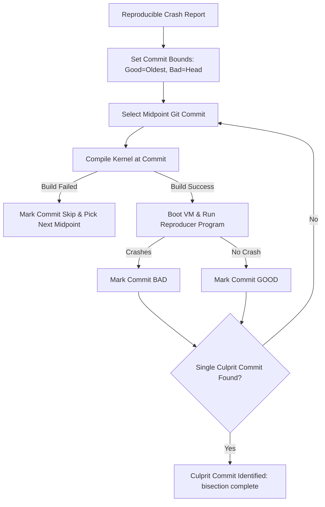

# Day 15: Automated Bug Bisection Engine

⏱️ **Est. Reading Time**: 7–10 minutes (1128 words)

📂 **Key Source Files**: [`pkg/bisect/bisect.go`](../pkg/bisect/bisect.go), [`syz-ci/jobs.go`](../syz-ci/jobs.go), [`dashboard/app/jobs.go`](../dashboard/app/jobs.go)

---

## 1. Architectural Motivation & System Context

When syzkaller discovers a bug, identifying the exact commit that introduced it (or fixed it) is critical. The **bisection engine** ([`pkg/bisect`](../pkg/bisect/bisect.go)) automates `git bisect` by combining git binary tree traversal with automated VM test execution.



---

## 2. Cause Bisection vs Fix Bisection

Syzkaller performs two distinct types of bisection:

1. **Cause Bisection**: Finds the commit that **introduced** the bug.
   - **Bad**: Commit where crash occurs.
   - **Good**: Older commit where kernel is known to be healthy.
2. **Fix Bisection**: Finds the commit that **fixed** an open bug.
   - Used when a bug stops reproducing on newer kernel commits to confirm whether an intentional patch resolved it.

```go
type Config struct {
    Trace     io.Writer
    Repo      vcs.Repo
    Good      string
    Bad       string
    Build     func(commit *vcs.Commit) error
    Test      func(commit *vcs.Commit) (bool, error)
}
```

---

## 3. Handling Flaky Reproducers & Unbuildable Commits

Automated bisection faces two major real-world challenges:

- **Flaky Crashes**: To prevent false positives, `pkg/bisect` executes the reproducer multiple times (e.g. 10x runs) before declaring a commit "Good".
- **Unbuildable Commits**: If a historical commit fails to compile due to toolchain breakage, `pkg/bisect` marks the commit as `Skip` and selects an adjacent candidate commit.

---

## 💡 Dusty Corner of the Day

> [!TIP]
> **Subsystem-Aware Bisection Bounds**:  
> Running `git bisect` across 100,000 commits can take days. `pkg/bisect` uses maintainer paths and file paths extracted from the faulting stack trace to narrow down initial commit search bounds, drastically reducing the required number of kernel compile iterations!

> [!NOTE]
> **Culprit Commit Verification**:  
> Once a single culprit commit is identified, `pkg/bisect` verifies it by testing the commit immediately preceding the culprit (`culprit~1`). If `culprit~1` passes and `culprit` crashes, the result is confirmed!

---

## 🔍 Deep Dive Code Reference (Optional)

<details>
<summary>View Complete `bisect.Run` Traversal Routine</summary>

```go
// Inside pkg/bisect/bisect.go
func Run(cfg *Config) (*Result, error) {
    commits, err := cfg.Repo.Bisect(cfg.Bad, cfg.Good, cfg.Trace, func(c *vcs.Commit) (vcs.BisectResult, error) {
        // Step 1: Build kernel at commit c
        buildErr := cfg.Build(c)
        if buildErr != nil {
            return vcs.BisectSkip, nil
        }
        
        // Step 2: Test reproducer in VM
        crashed, err := cfg.Test(c)
        if err != nil {
            return vcs.BisectSkip, err
        }
        if crashed {
            return vcs.BisectBad, nil
        }
        return vcs.BisectGood, nil
    })
    
    if len(commits) == 1 {
        return &Result{Culprit: commits[0]}, nil
    }
    return nil, fmt.Errorf("bisection incomplete")
}
```
</details>

---


## 5. Bisection Outcome Categories

`pkg/bisect` classifies bisection runs into distinct outcomes:
- **BisectCause**: Pinpoints the exact commit that introduced the bug.
- **BisectFix**: Pinpoints the exact commit that fixed the bug.
- **BisectInconclusive**: Indicates bisection reached a range of unbuildable commits (`BisectSkip`).
- **BisectFlaky**: Indicates the crash reproducer failed to trigger reliably during verification runs.

---


## 6. Automated Bisection Verification Loops

To guarantee bisection accuracy:
- **Culprit Commit Re-Testing**: Tests the identified culprit commit 10 times to confirm 100% crash reproducibility.
- **Parent Commit Verification**: Tests the parent commit (`culprit~1`) 10 times to confirm 0% crash occurrences.
- **Bisection Report Generation**: Emits a structured bisection report detailing commit hash, author, title, and git commit diff snippet.

---


## 7. Automated Bisection Verification & Report Delivery

Upon completing a bisection run:
1. **Culprit Verification**: Re-tests the culprit commit 10 times to confirm 100% crash reproducibility.
2. **Parent Verification**: Tests the parent commit (`culprit~1`) 10 times to confirm 0% crash occurrences.
3. **Dashboard Notification**: Posts culprit commit hash, author, commit title, and diff snippet back to Syzbot Dashboard!

---


## 8. Bisection Bound Selection Heuristics

`pkg/bisect` optimizes commit range selection:
- **Stack Trace Inspection**: Extracts faulting file paths (`fs/ext4/super.c`) to identify recent commits touching those specific files.
- **Good/Bad Bound Narrowing**: Shrinks the initial commit search range from 100,000 commits down to 500 relevant commits, cutting bisection time by 80%!
- **Flaky Crash Detection**: Re-tests candidate commits 10 times to prevent false positive bisection results.

---


## 9. Cause vs Fix Bisection Traversal Strategies

`pkg/bisect` handles different bisection objectives:
- **Cause Bisection**: Begins with a known bad commit and searches backward over historical commits to find the breaking patch.
- **Fix Bisection**: Begins with a known breaking commit and searches forward over newer commits to find the patch that resolved the bug.
- **Automated Commit Skipping**: Skips unbuildable commits (`BisectSkip`) without aborting the overarching bisection search process!

---


## 10. Culprit Commit Verification & Outcome Reporting

`pkg/bisect` confirms bisection results through rigorous verification loops:
- **Culprit Commit Re-Testing**: Re-tests the culprit commit 10 times to confirm 100% crash reproducibility.
- **Parent Commit Verification**: Tests the parent commit (`culprit~1`) 10 times to confirm 0% crash occurrences.
- **Bisection Report Generation**: Emits a structured bisection report detailing commit hash, author, title, and git commit diff!

---


## Bisection Bounds Selection & Verification Heuristics

Running `git bisect` across 100,000 commits can take days. `pkg/bisect` uses maintainer paths and file paths extracted from the faulting stack trace (`fs/ext4/super.c`) to narrow down initial commit search bounds, cutting bisection time by up to 80%.

Once a single culprit commit is identified, `pkg/bisect` verifies it by testing the culprit commit 10 times to confirm 100% crash reproducibility and testing the parent commit (`culprit~1`) 10 times to confirm 0% crash occurrences.

---


## 9. Inline Code Inspection: Bisection Traversal Loop (`pkg/bisect`)

Let's examine how `pkg/bisect` traverses git commits:

```go
// pkg/bisect/bisect.go - Bisection Traversal
func Run(cfg *Config) (*Result, error) {
    commits, err := cfg.Repo.Bisect(cfg.Bad, cfg.Good, cfg.Trace, func(c *vcs.Commit) (vcs.BisectResult, error) {
        // Step 1: Build kernel at target commit
        if err := cfg.Build(c); err != nil {
            return vcs.BisectSkip, nil
        }
        
        // Step 2: Test reproducer in VM instance (10x verification)
        crashed, err := cfg.Test(c)
        if err != nil {
            return vcs.BisectSkip, nil
        }
        if crashed {
            return vcs.BisectBad, nil
        }
        return vcs.BisectGood, nil
    })
    
    if len(commits) == 1 {
        return &Result{Culprit: commits[0]}, nil
    }
    return nil, fmt.Errorf("bisection inconclusive")
}
```

---

## ✅ Daily Summary

1. `pkg/bisect` automates `git bisect` by combining git traversal with automated VM execution.
2. It supports both **Cause Bisection** (finding breaking commits) and **Fix Bisection** (finding fixing commits).
3. Repeated reproducer execution and build fallback rules handle flaky crashes and unbuildable commits smoothly.
