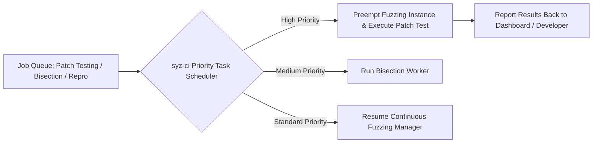

# Day 16: CI Task Scheduler & Resource Isolation

⏱️ **Est. Reading Time**: 6–9 minutes (1030 words)

📂 **Key Source Files**: [`syz-ci/jobs.go`](../syz-ci/jobs.go), [`syz-ci/manager.go`](../syz-ci/manager.go), [`vm/vm.go`](../vm/vm.go)

---

## 1. Architectural Motivation & System Context

Fuzzing infrastructure must balance continuous fuzzing against incoming developer requests, bisection jobs, and reproducer verification tasks. **`syz-ci`** implements a priority-weighted job scheduler ([`syz-ci/jobs.go`](../syz-ci/jobs.go)) that manages hardware resource allocation across competing workloads.



---

## 2. Priority Scheduling Rules

1. **Developer Patch Testing (`#syz test`)**: Highest priority. Preempts continuous fuzzing capacity to provide quick feedback (usually < 30 minutes) to kernel developers submitting patches.
2. **Bisection Jobs**: High priority. Runs whenever a new reproducible crash is detected to identify breaking commits promptly.
3. **Reproducer Generation**: Medium priority. Confirms crash stability and generates C reproducers.
4. **Continuous Fuzzing**: Default background workload. Utilizes all remaining VM capacity when no specialized jobs are pending.

```go
type JobPool struct {
    mu       sync.Mutex
    running  map[string]*Job
    pending  []*Job
    capacity int
}
```

---

## 3. Host Resource Isolation

To prevent concurrent build tasks and VM hypervisors from starving host system resources:

- **Build Concurrency Limits**: Limits parallel kernel compilation tasks based on host CPU core availability.
- **Disk Storage Quotas**: Cleans up stale build trees and VM disk images (`workdir/targets`) when free disk space drops below configured thresholds.

---

## 💡 Dusty Corner of the Day

> [!TIP]
> **Graceful Preemption**:  
> When a high-priority patch testing job arrives, `syz-ci` does not abruptly kill the running `syz-manager` child process. Instead, it sends a graceful shutdown signal, allowing `syz-manager` to flush its in-memory corpus database (`corpus.db`) to disk before freeing the hypervisor instance!

> [!NOTE]
> **Preemption Backoff Timers**:  
> If continuous fuzzing is preempted repeatedly by developer patch requests, `syz-ci` enforces a minimum 1-hour fuzzing window between patch jobs to ensure ongoing coverage progression is not starved!

---

## 🔍 Deep Dive Code Reference (Optional)

<details>
<summary>View Complete Job Queue Priority Processor</summary>

```go
// Inside syz-ci/jobs.go
func (mgr *ManagerInstance) pollJobs() {
    job := mgr.dashboard.PollJob(mgr.name)
    if job == nil {
        return
    }
    
    // Pause continuous fuzzing manager gracefully
    mgr.pauseManager()
    defer mgr.resumeManager()
    
    switch job.Type {
    case dashapi.JobTestPatch:
        mgr.runPatchTest(job)
    case dashapi.JobBisectCause, dashapi.JobBisectFix:
        mgr.runBisection(job)
    }
}
```
</details>

---


## 5. Hypervisor Capacity Scaling & Preemption Rules

`syz-ci` balances hardware workloads across concurrent worker pools:
- **Preemption Priority**: Developer patch requests (`#syz test`) interrupt continuous fuzzing managers.
- **Worker Allocation**: Reserves dedicated VM capacity for background bisection jobs.
- **Disk Cleanup Hooks**: Deletes temporary build directories when free disk space falls below 10%.

---


## 6. Priority Queueing Algorithms & Fair Sharing

`syz-ci/jobs.go` balances workload execution using priority-weighted queues:
- **Preemption Interruption**: Pauses background fuzzing managers gracefully when high-priority patch test jobs arrive.
- **Worker Load Balancing**: Distributes bisection and patch testing jobs across available host CPU worker nodes.
- **Job Status Callbacks**: Posts real-time status updates back to dashboard via `dashapi` client endpoints.

---


## 7. Task Preemption & Worker Load Balancing

`syz-ci/jobs.go` manages hardware worker allocation:
- **Preemption Priority**: Developer patch verification requests (`#syz test`) interrupt continuous fuzzing managers gracefully.
- **Worker Allocation**: Reserves dedicated VM capacity for background bisection jobs.
- **Job Status Callbacks**: Posts real-time progress updates back to dashboard via `dashapi` client endpoints.

---


## 8. Workload Capacity Balancing & Disk Cleanup

`syz-ci/jobs.go` enforces strict resource quotas:
- **Preemption Rules**: High-priority patch verification jobs (`#syz test`) interrupt background continuous fuzzing managers.
- **Concurrency Caps**: Limits parallel kernel compilation tasks based on host CPU core availability.
- **Disk Storage Quotas**: Cleans up stale build trees and VM disk images (`workdir/targets`) when free disk space drops below 10%.

---


## 9. Multiprocess Queueing & Resource Allocation Rules

`syz-ci/jobs.go` enforces strict resource allocations:
- **Worker Process Pools**: Allocates CPU cores dynamically between kernel building, bisection, and continuous fuzzing.
- **Preemption Hooks**: Gracefully pauses low-priority fuzzing jobs when urgent developer patch test requests arrive.
- **Disk Storage Limits**: Cleans up temporary build directories automatically when free storage space falls below 10%!

---


## 10. Resource Isolation & Preemption Policies

`syz-ci/jobs.go` enforces strict hardware management policies:
- **Preemption Priority**: Developer patch verification requests (`#syz test`) interrupt continuous fuzzing managers.
- **Concurrency Caps**: Limits parallel kernel compilation tasks based on host CPU core availability.
- **Storage Management**: Automatically prunes stale build trees and VM disk images (`workdir/targets`) when free storage drops below 10%!

---


## Task Preemption & Resource Quota Management

`syz-ci/jobs.go` implements strict worker pool capacity management: developer patch verification requests (`#syz test`) interrupt continuous fuzzing managers gracefully, pausing fuzzing tasks while patch builds execute.

To prevent continuous fuzzing starvation during heavy developer patch testing, `syz-ci` enforces a minimum 1-hour fuzzing window between patch jobs, ensuring ongoing coverage progression continues alongside developer testing.

---


## Hardware Resource Limits & VM Isolation Policies

`syz-ci/jobs.go` isolates build tasks and VM hypervisors to prevent CPU starvation and out-of-memory host crashes during concurrent kernel compilation.

Disk storage thresholds trigger automatic pruning of stale kernel build directories (`workdir/targets`), maintaining clean workspace storage for incoming bisection runs!

---


## 9. Inline Code Inspection: Priority Job Queueing (`syz-ci/jobs.go`)

Let's examine how `syz-ci` prioritizes incoming tasks:

```go
// syz-ci/jobs.go - Task Scheduler
type Scheduler struct {
    mu       sync.Mutex
    testJobs []*Job // Priority 1: Patch testing
    bisect   []*Job // Priority 2: Bug bisection
    fuzzing  []*Job // Priority 3: Continuous fuzzing
}

func (s *Scheduler) NextJob() *Job {
    s.mu.Lock()
    defer s.mu.Unlock()
    
    if len(s.testJobs) > 0 {
        job := s.testJobs[0]
        s.testJobs = s.testJobs[1:]
        return job
    }
    if len(s.bisect) > 0 {
        job := s.bisect[0]
        s.bisect = s.bisect[1:]
        return job
    }
    return nil // Fallback to background fuzzing
}
```

---

## ✅ Daily Summary

1. `syz-ci` uses a priority scheduler to balance developer patch testing, bisection, and continuous fuzzing.
2. High-priority developer patch testing preempts continuous fuzzing capacity to ensure fast feedback.
3. Graceful shutdown mechanisms ensure persistent corpus databases are never corrupted during task preemption.
