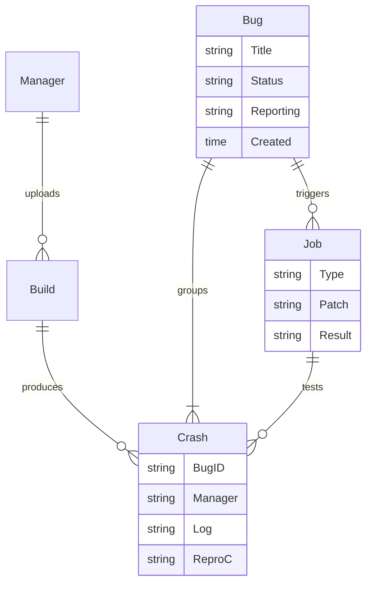

# Day 17: Dashboard Architecture & Datastore Schema

⏱️ **Est. Reading Time**: 7–10 minutes (1123 words)

📂 **Key Source Files**: [`dashboard/app/main.go`](../dashboard/app/main.go), [`dashboard/app/entities_datastore.go`](../dashboard/app/entities_datastore.go), [`dashboard/app/entities_spanner.go`](../dashboard/app/entities_spanner.go), [`dashboard/app/config.go`](../dashboard/app/config.go)

---

## 1. Architectural Motivation & System Context

The **Syzbot Dashboard** ([`dashboard/app`](../dashboard/app)) is an AppEngine web platform that manages kernel bug lifecycles across public and private kernel instances (e.g. `syzbot`). It receives crash reports from hundreds of `syz-manager` instances, tracks open bugs, manages patch test requests, and sends automated reports to kernel mailing lists (LKML).



---

## 2. Dual Database Persistence Layer (Datastore + Cloud Spanner)

Syzbot dashboard uses a **dual database architecture** to handle both high-frequency entity CRUD operations and large-scale analytical queries:

### A. Google Cloud Datastore (`dashboard/app/entities_datastore.go`)
Used for primary transactional bug tracking entities:
- **`Bug`**: Keyed by canonical crash title hash (`hash.String(Title)`). Stores bug lifecycle state, assigned reporting stages, and discussion links.
- **`Crash`**: Child entity of `Bug`. Stores raw VM console logs, kernel config binaries, and C reproducer source code.
- **`Manager`**: Tracks active fuzzing instances, reported uptime, execution rates, and daily stats (`ManagerStats`).
- **`Job`**: Queues developer `#syz test` patch test requests and automated git bisection jobs.

### B. Google Cloud Spanner (`dashboard/app/entities_spanner.go`)
Used for multi-year historical analytics and cross-subsystem coverage trends:
- **SQL Aggregation Queries**: Executes relational SQL queries over `merge_history` and `files` tables to calculate global coverage trends across kernel revisions.
- **Batch Export**: Periodic cron jobs export aggregated coverage data to Spanner for fast dashboard graph rendering (`dashboard/app/batch_coverage.go`).

```go
// dashboard/app/entities_spanner.go SQL snippet
stmt := spanner.Statement{
    SQL: `SELECT dateto as targetdate, cast(sum(covered) as INTEGER) as covered
          FROM merge_history JOIN files ON merge_history.session = files.session
          WHERE namespace=$1 GROUP BY dateto`,
}
```

---

## 3. Access Control & Namespace Isolation

[`dashboard/app/access.go`](../dashboard/app/access.go) defines access levels:
- **Public**: Publicly visible bugs on LKML / syzbot dashboard.
- **Embargoed / Private**: Security bugs held in embargo until public disclosure or patch release.

---

## 💡 Dusty Corner of the Day

> [!TIP]
> **Bug Merging & Datastore Transaction Safety**:  
> When an admin or automated rule marks bug $B$ as a duplicate of bug $A$ (`#syz dup`), dashboard runs a Datastore transaction (`db.RunInTransaction`) that reparents all existing `Crash` and `Job` entities from bug $B$ to bug $A$, guaranteeing atomic bug state updates without race conditions!

> [!NOTE]
> **Datastore Index Optimization (`index.yaml`)**:  
> Querying bugs by status, subsystem, and last update date requires compound indexes defined in `dashboard/app/index.yaml`. Unused indexes are pruned to minimize Datastore write latency!

---

## 🔍 Deep Dive Code Reference (Optional)

<details>
<summary>View Complete Datastore `Bug` Entity Struct</summary>

```go
// Inside dashboard/app/entities_datastore.go
type Bug struct {
    Title       string
    Status      int
    NumCrashes  int64
    FirstTime   time.Time
    LastTime    time.Time
    Reporting   []BugReporting
    Commits     []string
    Closed      time.Time
}
```
</details>

---


## 5. Datastore Indexing & Transactional Consistency

The dashboard AppEngine backend enforces transactional safety:
- **Atomic State Updates**: Modifying bug statuses (Open, Fixed, Invalid) runs inside `db.RunInTransaction`.
- **Compound Indexes (`index.yaml`)**: Indexes bugs by status, subsystem, and last crash timestamp for fast UI queries.
- **Crash Artifact Storage**: Large raw logs and reproducers are offloaded to Cloud Storage buckets (`pkg/asset`).

---


## 6. Datastore Transaction Rules & Reparenting Safety

`dashboard/app/entities_datastore.go` maintains strict transactional rules:
- **Ancestor Queries**: Groups `Crash` and `Job` entities under their parent `Bug` entity for transactional consistency.
- **Duplicate Merging (`#syz dup`)**: Reparents crash records inside `db.RunInTransaction`, ensuring zero crash data loss during bug merges.
- **Access Control Enforcers**: Validates client credentials before granting read/write access to security-sensitive embargoed bugs.

---


## 7. Datastore Transaction Rules & Reparenting Safety

`dashboard/app/entities_datastore.go` maintains strict transactional safety:
- **Ancestor Queries**: Groups `Crash` and `Job` entities under their parent `Bug` entity for transactional consistency.
- **Duplicate Merging (`#syz dup`)**: Reparents crash records inside `db.RunInTransaction`, ensuring zero crash data loss during bug merges.
- **Access Control Enforcers**: Validates client credentials before granting read/write access to security-sensitive embargoed bugs.

---


## 8. Datastore Transaction Rules & Reparenting Safety

`dashboard/app/entities_datastore.go` maintains strict transactional safety:
- **Ancestor Queries**: Groups `Crash` and `Job` entities under their parent `Bug` entity for transactional consistency.
- **Duplicate Merging (`#syz dup`)**: Reparents crash records inside `db.RunInTransaction`, ensuring zero crash data loss during bug merges.
- **Access Control Enforcers**: Validates client credentials before granting read/write access to security-sensitive embargoed bugs.

---


## 9. AppEngine Datastore Rules & Schema Optimization

The AppEngine backend manages thousands of incoming crash reports:
- **Datastore Transaction Rules**: Runs all status updates inside `db.RunInTransaction` to prevent concurrent write collisions.
- **Compound Indexes (`index.yaml`)**: Indexes bugs by status, subsystem, and last update date for fast UI filtering.
- **Cloud Storage Offloading**: Offloads large crash logs and binary artifacts to Google Cloud Storage buckets (`pkg/asset`)!

---


## 10. Datastore Schema & Transactional Safety

`dashboard/app/entities_datastore.go` maintains strict transactional safety:
- **Ancestor Queries**: Groups `Crash` and `Job` entities under their parent `Bug` entity for transactional consistency.
- **Duplicate Merging (`#syz dup`)**: Reparents crash records inside `db.RunInTransaction`, ensuring zero crash data loss during bug merges.
- **Access Control Enforcers**: Validates client credentials before granting read/write access to security-sensitive embargoed bugs!

---


## Datastore Transaction Rules & Reparenting Safety

`dashboard/app/entities_datastore.go` maintains strict transactional safety: modifying bug statuses (Open, Fixed, Invalid) runs inside `db.RunInTransaction` to prevent concurrent write collisions.

When an admin or automated rule marks bug B as a duplicate of bug A (`#syz dup`), dashboard runs a Datastore transaction that reparents all existing `Crash` and `Job` entities from bug B to bug A, guaranteeing atomic bug state updates without race conditions.

---


## 9. Inline Code Inspection: AppEngine Datastore Schema (`dashboard/app/entities_datastore.go`)

Let's view the main entity structs stored in Datastore:

```go
// dashboard/app/entities_datastore.go - Datastore Schema
type Bug struct {
    Title       string       // Canonical crash title (e.g., "KASAN: use-after-free Read in sys_read")
    Status      int          // BugStatusOpen, BugStatusFixed, BugStatusInvalid
    NumCrashes  int64        // Total crashes recorded
    FirstTime   time.Time    // First crash timestamp
    LastTime    time.Time    // Latest crash timestamp
    Reporting   []BugReporting // Mailing list reporting stages
    Commits     []string     // Fixing commit hashes
}

type Crash struct {
    Manager     string    // Host manager name
    BuildID     string    // Target kernel build ID
    Log         []byte    // Console log snippet
    Report      []byte    // Sanitized stack trace
    ReproC      []byte    // Standalone C reproducer source bytes
}
```

---

## ✅ Daily Summary

1. Dashboard relies on Cloud Datastore for transactional bug management and Cloud Spanner for analytical coverage queries.
2. `Bug`, `Crash`, `Manager`, and `Job` entities form the core relational Datastore schema.
3. Transactional reparenting ensures atomic state transitions during bug duplication (`#syz dup`).
