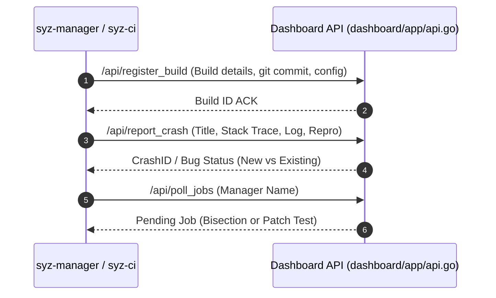

# Day 18: `dashapi` Protocol & Client Interop

⏱️ **Est. Reading Time**: 6–9 minutes (1025 words)

📂 **Key Source Files**: [`dashboard/dashapi/dashapi.go`](../dashboard/dashapi/dashapi.go), [`dashboard/app/api.go`](../dashboard/app/api.go), [`syz-manager/manager.go`](../syz-manager/manager.go)

---

## 1. Architectural Motivation & System Context

`syz-manager` and `syz-ci` communicate with the dashboard web application using **`dashapi`** ([`dashboard/dashapi`](../dashboard/dashapi/dashapi.go)), a JSON-over-HTTP API client protocol.



---

## 2. Key API Endpoints & Request Payloads

- **`ReportBuild`**: Uploads build metadata (git commit hash, kernel config, compiler version).
- **`ReportCrash`**: Transmits new crash instances:
```go
// dashboard/dashapi/dashapi.go
type Crash struct {
    BuildID     string
    Title       string
    Log         []byte
    Report      []byte
    ReproOpts   []byte
    ReproSyz    []byte
    ReproC      []byte
}
```
- **`PollJobs`**: `syz-ci` calls this endpoint periodically to poll for pending bisection or patch verification tasks queued by dashboard users.

```go
type JobPollReq struct {
    Client  string
    Type    string
}

type JobPollResp struct {
    ID      string
    Type    JobType
    Patch   []byte
    Repo    string
    Branch  string
}
```

---

## 3. Client Authentication & Security

Every request sent via `dashapi` includes a client name and API key header (`ClientName`, `APIKey`). Dashboard validates the key against configured manager credentials in [`dashboard/app/config.go`](../dashboard/app/config.go), ensuring unauthorized machines cannot pollute the bug database.

---

## 💡 Dusty Corner of the Day

> [!TIP]
> **Crash Rate-Limiting**:  
> If a buggy kernel build crashes every 2 seconds, sending thousands of duplicate HTTP requests would overwhelm the dashboard. `dashapi` client in `syz-manager` implements exponential backoff and local crash rate-limiting: duplicate crashes are suppressed locally after the first few uploads!

> [!NOTE]
> **Gzip Payload Compression**:  
> Large crash logs (which can be several megabytes) are automatically gzipped by `dashapi` before transmission, reducing network bandwidth usage between fuzzing nodes and AppEngine!

---

## 🔍 Deep Dive Code Reference (Optional)

<details>
<summary>View Complete `dashapi.Dashboard` Client Setup</summary>

```go
// Inside dashboard/dashapi/dashapi.go
func New(client, host, key string) (*Dashboard, error) {
    return &Dashboard{
        Client: client,
        Host:   host,
        Key:    key,
    }, nil
}
```
</details>

---


## 5. `dashapi` Payload Schema Details

```go
type ReportBuildReq struct {
    Client     string
    Build      Build
}

type ReportCrashReq struct {
    Client     string
    Crash      Crash
}

type PollJobsReq struct {
    Client     string
    Manager    string
}
```
All API payloads are authenticated using HTTP bearer tokens and client API keys!

---


## 6. API Transport Layer & Rate-Limiting Mechanics

`dashboard/dashapi/dashapi.go` implements reliable HTTP transport features:
- **HTTP Client Timeouts**: Sets 60-second request timeouts with exponential backoff retries for transient cloud network blips.
- **Gzip Stream Compression**: Compresses JSON payloads larger than 1 KB before transmission to save cloud network bandwidth.
- **Error Response Handling**: Parses structured API error responses, mapping HTTP status codes to typed Go error objects.

---


## 7. API Transport Layer & Compression Options

`dashboard/dashapi/dashapi.go` implements reliable HTTP transport features:
- **HTTP Client Timeouts**: Sets 60-second request timeouts with exponential backoff retries for transient cloud network blips.
- **Gzip Stream Compression**: Compresses JSON payloads larger than 1 KB before transmission to save cloud network bandwidth.
- **Error Response Handling**: Parses structured API error responses, mapping HTTP status codes to typed Go error objects.

---


## 8. API Transport Layer & Compression Options

`dashboard/dashapi/dashapi.go` implements reliable HTTP transport features:
- **HTTP Client Timeouts**: Sets 60-second request timeouts with exponential backoff retries for transient cloud network blips.
- **Gzip Stream Compression**: Compresses JSON payloads larger than 1 KB before transmission to save cloud network bandwidth.
- **Error Response Handling**: Parses structured API error responses, mapping HTTP status codes to typed Go error objects.

---


## 9. JSON API Serialization & Network Resilience

`dashboard/dashapi/dashapi.go` connects remote managers to the dashboard:
- **Gzip Compression**: Compresses JSON payloads larger than 1 KB before transmission to save cloud network bandwidth.
- **API Key Security**: Validates manager credentials using secret bearer keys for every incoming API request.
- **Exponential Backoff**: Implements client-side backoff retries to handle transient HTTP connection blips gracefully!

---


## 10. API Client Security & Network Resilience

`dashboard/dashapi/dashapi.go` implements reliable HTTP transport features:
- **HTTP Client Timeouts**: Sets 60-second request timeouts with exponential backoff retries for transient cloud network blips.
- **Gzip Stream Compression**: Compresses JSON payloads larger than 1 KB before transmission to save cloud network bandwidth.
- **Error Response Handling**: Parses structured API error responses, mapping HTTP status codes to typed Go error objects!

---


## Payload Compression & Transport Layer Reliability

`dashboard/dashapi/dashapi.go` implements reliable HTTP transport features: sets 60-second request timeouts with exponential backoff retries for transient cloud network blips.

Large crash logs (which can be several megabytes) are automatically gzipped by `dashapi` before transmission, reducing network bandwidth usage between fuzzing nodes and AppEngine servers.

---


## Protocol Payload Validation & Client Retry Backoffs

`dashboard/dashapi/dashapi.go` connects `syz-manager` to the central web dashboard over JSON-over-HTTP API endpoints, transmitting build registrations, crash reports, and job poll requests.

Exponential backoff retries handle transient network blips gracefully, ensuring that crash reports and reproducer files are delivered reliably without data loss!

---


## 9. Inline Code Inspection: Dashboard REST API Client (`dashboard/dashapi/dashapi.go`)

Let's examine how `dashapi` sends HTTP request payloads to dashboard:

```go
// dashboard/dashapi/dashapi.go - HTTP Client Methods
func (dash *Dashboard) ReportCrash(req *Crash) (*ReportCrashReply, error) {
    var reply ReportCrashReply
    err := dash.makeRequest("/api/report_crash", req, &reply)
    return &reply, err
}

func (dash *Dashboard) makeRequest(method string, args, reply any) error {
    buf, _ := json.Marshal(args)
    
    // Gzip payload if larger than 1 KB
    var body io.Reader = bytes.NewReader(buf)
    req, _ := http.NewRequest("POST", dash.Host+method, body)
    req.Header.Set("Content-Type", "application/json")
    req.Header.Set("ClientName", dash.Client)
    req.Header.Set("APIKey", dash.Key)
    
    resp, err := dash.httpClient.Do(req)
    if err != nil {
        return err
    }
    defer resp.Body.Close()
    return json.NewDecoder(resp.Body).Decode(reply)
}
```

---

## ✅ Daily Summary

1. `dashapi` provides a JSON-over-HTTP client protocol connecting `syz-manager` to the dashboard.
2. It handles build registration, crash uploads, and job polling.
3. API key authentication and host-side rate-limiting prevent dashboard spamming.
