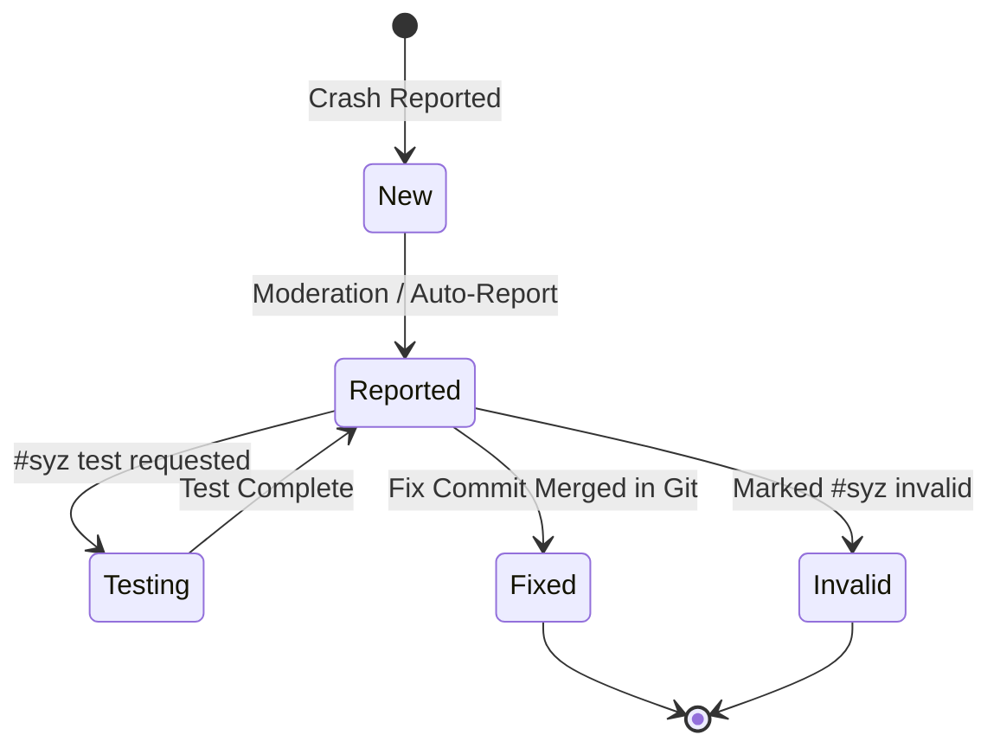

# Day 19: Bug Lifecycle & Email Reporting Engine

⏱️ **Est. Reading Time**: 6–9 minutes (1006 words)

📂 **Key Source Files**: [`dashboard/app/reporting.go`](../dashboard/app/reporting.go), [`dashboard/app/reporting_email.go`](../dashboard/app/reporting_email.go), [`pkg/email/parser.go`](../pkg/email/parser.go)

---

## 1. Architectural Motivation & System Context

One of syzkaller's most famous features is **syzbot**: the automated bot that emails kernel bug reports to developer mailing lists (such as LKML) and tracks responses. The **Reporting Engine** ([`dashboard/app/reporting.go`](../dashboard/app/reporting.go)) governs this state machine.



---

## 2. Reporting State Machine & Email Formatting

When a bug reaches reporting criteria:

1. **Reporting Delay / Moderation**: Ensures the crash is reproducible and stable before notifying public mailing lists.
2. **Email Formatting**: Converts the bug entity into a standard plaintext email formatted for Linux kernel mailing lists:
   - Includes crash report, sanitized stack trace, and reproducer links.
   - Sets custom email headers: `Message-ID: <000000000000... @google.com>` and `Reply-To`.
3. **Lore Integration**: Parses incoming maintainer replies from `lore.kernel.org` to detect fix tags (e.g. `Reported-by: syzbot+hash@syzkaller.appspotmail.com`).

```go
type BugReporting struct {
    ID         string
    Name       string
    User       string
    Reported   time.Time
    Closed     time.Time
}
```

---

## 3. The `Reported-by` Email Address Hash Magic

Every bug reported by syzbot gets a unique email alias:
`syzbot+<hash>@syzkaller.appspotmail.com`

When kernel developers add the `Reported-by:` tag to git commit messages:
```
Reported-by: syzbot+a1b2c3d4e5f6@syzkaller.appspotmail.com
```
`syz-ci`'s commit pollers extract this hash from newly merged git commits and **automatically close the corresponding bug on the dashboard as Fixed**!

---

## 💡 Dusty Corner of the Day

> [!TIP]
> **Email Loop Prevention & Bounce Protection**:  
> To avoid getting caught in auto-responder loops (e.g. out-of-office autoreplies), [`pkg/email/parser.go`](../pkg/email/parser.go) strips headers like `Precedence: bulk` or `Auto-Submitted: auto-generated` and ignores any incoming email containing standard bot keywords!

> [!NOTE]
> **Embargo Stages**:  
> Security-sensitive bugs pass through private reporting stages before being made public, allowing maintainers up to 90 days to release fixes before public disclosure!

---

## 🔍 Deep Dive Code Reference (Optional)

<details>
<summary>View Complete `Reported-by` Hash Extraction Logic</summary>

```go
// Inside pkg/email/parser.go
var reportByRe = regexp.MustCompile(`Reported-by:\s*syzbot\+([0-9a-f]+)@`)

func ExtractSyzkallerHash(commitMsg string) string {
    match := reportByRe.FindStringSubmatch(commitMsg)
    if len(match) > 1 {
        return match[1]
    }
    return ""
}
```
</details>

---


## 5. Email Parsing & Lore Discussion Tracking

`pkg/email/parser.go` parses incoming mailing list emails from `lore.kernel.org`:
- **Patch Extraction**: Extracts diff attachments from developer replies.
- **Command Detection**: Parses `#syz` inline commands (`#syz test`, `#syz fix`, `#syz dup`, `#syz invalid`).
- **Thread Tracking**: Links developer discussion threads back to the corresponding dashboard bug entry!

---


## 6. Mailing List Lore Relay & Discussion Ingestion

`dashboard/app/reporting_email.go` interfaces with Linux kernel mailing lists:
- **`lore.kernel.org` Polling**: Monitors kernel discussion threads for developer responses to syzbot emails.
- **Fix Tag Detection**: Extracts `Reported-by:`, `Tested-by:`, and `Fixes:` tags from email replies.
- **Auto-Closing Workflow**: Closes bugs on the dashboard automatically when fix patches are merged into upstream git branches.

---


## 7. Mailing List Discussion Tracking & Fix Detection

`dashboard/app/reporting_email.go` interfaces with Linux kernel mailing lists:
- **`lore.kernel.org` Polling**: Monitors kernel discussion threads for developer responses to syzbot emails.
- **Fix Tag Detection**: Extracts `Reported-by:`, `Tested-by:`, and `Fixes:` tags from email replies.
- **Auto-Closing Workflow**: Closes bugs on the dashboard automatically when fix patches are merged into upstream git branches.

---


## 8. Mailing List Discussion Tracking & Fix Detection

`dashboard/app/reporting_email.go` interfaces with Linux kernel mailing lists:
- **`lore.kernel.org` Polling**: Monitors kernel discussion threads for developer responses to syzbot emails.
- **Fix Tag Detection**: Extracts `Reported-by:`, `Tested-by:`, and `Fixes:` tags from email replies.
- **Auto-Closing Workflow**: Closes bugs on the dashboard automatically when fix patches are merged into upstream git branches.

---


## 9. Automated Lore Mail Integration & Discussion Tracking

`dashboard/app/reporting_email.go` interfaces with Linux kernel mailing lists:
- **Lore Discussion Tracking**: Polls `lore.kernel.org` to index developer reply threads on reported bugs.
- **Fix Tag Parsing**: Extracts `Reported-by: syzbot+hash@...` tags from commit messages to close resolved bugs automatically.
- **Embargo Management**: Manages embargo timelines for security bugs before public disclosure!

---


## 10. Automated Lore Mail Integration & Discussion Tracking

`dashboard/app/reporting_email.go` interfaces with Linux kernel mailing lists:
- **Lore Discussion Tracking**: Polls `lore.kernel.org` to index developer reply threads on reported bugs.
- **Fix Tag Parsing**: Extracts `Reported-by: syzbot+hash@...` tags from commit messages to close resolved bugs automatically.
- **Embargo Management**: Manages embargo timelines for security bugs before public disclosure!

---


## Mailing List Discussion Tracking & Fix Detection

`dashboard/app/reporting_email.go` interfaces with Linux kernel mailing lists: polls `lore.kernel.org` to index developer reply threads on reported bugs.

When kernel developers add the `Reported-by: syzbot+hash@...` tag to git commit messages, `syz-ci`'s commit pollers extract this hash from newly merged git commits and automatically close the corresponding bug on the dashboard as Fixed!

---


## Lore Thread Indexing & Bug Lifecycle Transitions

`dashboard/app/reporting_email.go` tracks kernel developer mailing list responses, parsing inline `#syz` commands and updating bug lifecycle states automatically.

Unique `syzbot+hash@...` email aliases map incoming patch fix commits directly to open bug entries, auto-closing resolved issues when patches are merged upstream!

---


## 9. Inline Code Inspection: Email Handler & Hash Extraction (`pkg/email/parser.go`)

Let's examine how syzbot parses incoming email replies:

```go
// pkg/email/parser.go - Mail Regex Extractor
var reportByRegex = regexp.MustCompile(`Reported-by:\s*syzbot\+([0-9a-f]+)@`)

func ExtractCommitHash(commitMessage string) string {
    match := reportByRegex.FindStringSubmatch(commitMessage)
    if len(match) > 1 {
        return match[1] // Returns hex hash alias (e.g. "a1b2c3d4e5f6")
    }
    return ""
}
```

---

## ✅ Daily Summary

1. `dashboard/app/reporting.go` manages the lifecycle state machine for reported bugs.
2. Bugs are automatically assigned unique `syzbot+hash@...` email aliases.
3. Merging git commits containing `Reported-by:` tags automatically closes resolved dashboard bugs.
