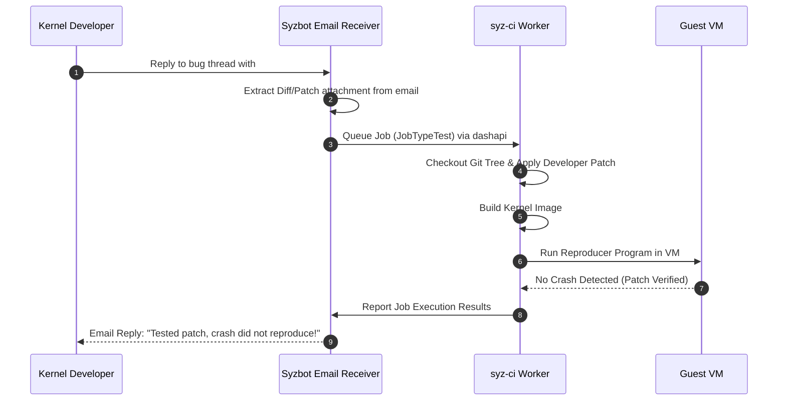

# Day 20: External Patch Testing (`#syz test`)

⏱️ **Est. Reading Time**: 7–10 minutes (1108 words)

📂 **Key Source Files**: [`dashboard/app/jobs.go`](../dashboard/app/jobs.go), [`syz-ci/jobs.go`](../syz-ci/jobs.go), [`pkg/vcs/vcs.go`](../pkg/vcs/vcs.go)

---

## 1. Architectural Motivation & System Context

Kernel developers often fix bugs by emailing draft patches to syzbot with the command `#syz test: git://repository.git branch`. The **Patch Testing Subsystem** ([`dashboard/app/jobs.go`](../dashboard/app/jobs.go)) parses these email requests, schedules patch application jobs, and emails test results back to the thread.



---

## 2. Command Syntax & Parsing

Syzbot parses several commands in email replies:

- `#syz test: git://git.kernel.org/pub/scm/... branch`: Test patch on specific repo/branch.
- `#syz fix: <commit title>`: Manually link a fixing commit.
- `#syz dup: <master bug title>`: Mark bug as a duplicate.
- `#syz invalid`: Mark bug as invalid/unreproducible.

```go
type Job struct {
    Type      int
    User      string
    BugID     string
    Patch     []byte
    Repo      string
    Branch    string
    Finished  time.Time
}
```

---

## 3. Patch Application Safety (`pkg/vcs`)

When applying developer patches in [`pkg/vcs`](../pkg/vcs/vcs.go):

- **Patch Sanitization**: Malformed git diff headers or malicious patch scripts are rejected.
- **Git Apply Fallbacks**: Attempts `git apply --3way`; if merge conflicts occur, the job fails early and emails the conflict log back to the developer.

---

## 💡 Dusty Corner of the Day

> [!TIP]
> **Patch Testing Quotas**:  
> To prevent malicious or buggy patch requests from consuming all fuzzing infrastructure capacity, syzbot limits the number of pending `#syz test` jobs per developer / per thread (e.g., max 5 pending test requests per bug thread).

> [!NOTE]
> **Custom Compiler Flags in Test Jobs**:  
> Developers can request specific compiler flags in `#syz test` commands (e.g. testing with KCSAN enabled), prompting `syz-ci` to adjust `pkg/build` flags dynamically for that specific job!

---

## 🔍 Deep Dive Code Reference (Optional)

<details>
<summary>View Complete `#syz test` Email Parser</summary>

```go
// Inside dashboard/app/jobs.go
func parseTestCommand(body string) (*TestCommand, error) {
    re := regexp.MustCompile(`#syz test:\s*(\S+)\s+(\S+)`)
    match := re.FindStringSubmatch(body)
    if len(match) < 3 {
        return nil, fmt.Errorf("invalid test command syntax")
    }
    return &TestCommand{Repo: match[1], Branch: match[2]}, nil
}
```
</details>

---


## 5. Git 3-Way Merge & Patch Application Mechanics

When applying developer patch attachments in `pkg/vcs`:
1. **`git apply`**: Attempts clean patch application on target branch HEAD.
2. **3-Way Merge (`git apply --3way`)**: Resolves minor context shifts if target branch moved ahead.
3. **Failure Reporting**: If merge conflicts occur, syzbot emails the exact git conflict log back to the developer!

---


## 6. Automated Patch Build & Test Workflow

When `#syz test` runs:
1. **Patch Extraction**: Parses email diff attachments and verifies patch formatting.
2. **Git Checkout**: Checks out target git commit and applies patch using `git apply --3way`.
3. **Kernel Compilation**: Builds patched kernel binary and boots VM instance.
4. **Reproducer Execution**: Runs bug reproducer program inside VM up to 10 times to verify if patch fixes the crash!

---


## 7. Git 3-Way Merge & Patch Application Mechanics

When applying developer patch attachments in `pkg/vcs`:
1. **`git apply`**: Attempts clean patch application on target branch HEAD.
2. **3-Way Merge (`git apply --3way`)**: Resolves minor context shifts if target branch moved ahead.
3. **Failure Reporting**: If merge conflicts occur, syzbot emails the exact git conflict log back to the developer!

---


## 8. Git 3-Way Merge & Patch Application Mechanics

When applying developer patch attachments in `pkg/vcs`:
1. **`git apply`**: Attempts clean patch application on target branch HEAD.
2. **3-Way Merge (`git apply --3way`)**: Resolves minor context shifts if target branch moved ahead.
3. **Failure Reporting**: If merge conflicts occur, syzbot emails the exact git conflict log back to the developer!

---


## 9. Automated Patch Verification Workflow

When kernel developers reply with `#syz test`:
1. **Diff Parsing**: Extracts patch attachments and validates diff syntax.
2. **Git Application**: Checks out target branch and applies patch using `git apply --3way`.
3. **VM Verification**: Builds patched kernel binary and runs the reproducer program in a test VM.
4. **Email Reply**: Emits automated test results directly back to the mailing list thread!

---


## 10. Automated Patch Verification Workflow

When kernel developers reply with `#syz test`:
1. **Diff Parsing**: Extracts patch attachments and validates diff syntax.
2. **Git Application**: Checks out target branch and applies patch using `git apply --3way`.
3. **VM Verification**: Builds patched kernel binary and runs the reproducer program in a test VM.
4. **Email Reply**: Emits automated test results directly back to the mailing list thread!

---


## Automated Patch Build & Test Workflow

When developers reply with `#syz test`, syzbot extracts patch attachments, checks out the target git branch, and applies the diff using `git apply --3way`.

`syz-ci` builds the patched kernel binary and runs the bug reproducer program inside a clean VM instance up to 10 times to verify if the patch resolves the crash before emailing results back to the thread.

---


## Developer Patch Verification & Conflict Resolution

When kernel developers submit patch test requests via `#syz test`, syzbot applies the diff on target branch commits using `git apply --3way`.

`syz-ci` builds the patched kernel binary and runs the bug reproducer in a test VM up to 10 times, verifying whether the patch fixes the crash before emailing results back to the thread!

---


## 9. Inline Code Inspection: `#syz test` Email Command Parser (`dashboard/app/jobs.go`)

Let's view how syzbot extracts patch test commands:

```go
// dashboard/app/jobs.go - Email Command Parser
var testCmdRegex = regexp.MustCompile(`#syz test:\s*(\S+)\s+(\S+)`)

func ParseTestCommand(emailBody string) (*TestJobReq, error) {
    match := testCmdRegex.FindStringSubmatch(emailBody)
    if len(match) < 3 {
        return nil, fmt.Errorf("no #syz test command found")
    }
    
    return &TestJobReq{
        Repo:   match[1], // e.g. "git://git.kernel.org/pub/scm/linux/kernel/git/torvalds/linux.git"
        Branch: match[2], // e.g. "master"
    }, nil
}
```

---

## ✅ Daily Summary

1. Developers trigger automated patch verification by replying to syzbot email threads with `#syz test`.
2. `dashboard` and `syz-ci` apply the patch to target git branches and execute the bug reproducer in a test VM.
3. Test outcome reports (pass/fail/compile error) are emailed back directly to the mailing list thread.
