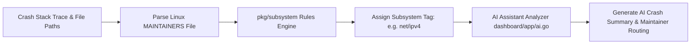

# Day 21: Subsystem Mapping & Automated Triage

⏱️ **Est. Reading Time**: 6–9 minutes (1048 words)

📂 **Key Source Files**: [`pkg/subsystem/entities.go`](../pkg/subsystem/entities.go), [`dashboard/app/subsystem.go`](../dashboard/app/subsystem.go), [`dashboard/app/ai.go`](../dashboard/app/ai.go), [`dashboard/app/ai_report.go`](../dashboard/app/ai_report.go)

---

## 1. Architectural Motivation & System Context

Routing kernel bugs to the correct maintainers requires mapping raw stack traces to Linux kernel **subsystems** (e.g. `net/ipv4`, `fs/ext4`, `drivers/media`). Syzkaller maintains an automated subsystem classification engine ([`pkg/subsystem`](../pkg/subsystem/entities.go)) along with AI crash analysis helpers ([`dashboard/app/ai.go`](../dashboard/app/ai.go)).



---

## 2. Kernel Maintainers File Parser (`pkg/subsystem`)

Syzkaller parses the Linux kernel's `MAINTAINERS` file to build a directory-to-maintainer graph:

1. **Path Matching**: Matches stack trace file paths (`net/ipv4/tcp.c`) to maintainer subsystem rules.
2. **Fallback Rules**: Uses function name prefix patterns (e.g. `ext4_*` $\to$ `fs/ext4`) when stack traces omit full source file paths.

```go
type Subsystem struct {
    Name       string
    PathRules  []PathRule
    ListEmails []string
    Maintainers []string
}

type PathRule struct {
    Include    string // Glob pattern (e.g. "net/ipv4/*")
    Exclude    string // Glob exclude pattern
}
```

---

## 3. AI Automated Crash Summaries ([`dashboard/app/ai.go`](../dashboard/app/ai.go))

Recent syzkaller dashboard releases integrate LLM AI analysis modules:

- **Root Cause Hypotheses**: Analyzes faulting instruction assembly, stack frames, and C reproducers to summarize the bug root cause in natural language.
- **Maintainer Routing**: Suggests specific maintainer email addresses based on past commit history in the affected subsystem.

---

## 💡 Dusty Corner of the Day

> [!TIP]
> **Subsystem Overrides**:  
> In complex bugs touching multiple layers (e.g. a `vfs` virtual file system call triggering a `btrfs` internal bug), path matching might initially misclassify the subsystem. `pkg/subsystem` includes custom rules that give higher weight to deep faulting frames over top-level entry syscall frames!

> [!NOTE]
> **Maintainer Email Fallback Heuristics**:  
> If `MAINTAINERS` lists no active list email for an obscure driver, `pkg/subsystem` falls back to querying `git log -n 50 --format='%aE' -- <filepath>` to email developers who recently touched the faulting code!

---

## 🔍 Deep Dive Code Reference (Optional)

<details>
<summary>View Complete Subsystem Classification Routine</summary>

```go
// Inside pkg/subsystem/entities.go
type Subsystem struct {
    Name       string
    PathRules  []string
    ListEmails []string
}
```
</details>

---


## 5. LLM Automated Crash Analysis & Summaries

`dashboard/app/ai.go` leverages LLM models to assist kernel maintainers:
- **Natural Language Summaries**: Translates raw KASAN stack traces into concise bug explanations.
- **Root Cause Hypotheses**: Highlights faulting memory access instructions and potential race conditions.
- **Maintainer Suggestions**: Recommends maintainer email addresses based on subsystem rules and commit history!

---


## 6. Subsystem Rules Engine & AI Crash Summaries

`pkg/subsystem` and `dashboard/app/ai.go` streamline crash triage:
- **MAINTAINERS Parsing**: Maps file paths in call traces (`net/ipv4/tcp.c`) to official kernel maintainer mailing lists.
- **LLM Bug Summaries**: Generates natural-language root-cause explanations from raw stack traces and C reproducer source code.
- **Maintainer Routing Suggestions**: Recommends appropriate kernel developer email addresses for patch submission!

---


## 7. Subsystem Rules Engine & AI Crash Summaries

`pkg/subsystem` and `dashboard/app/ai.go` streamline crash triage:
- **MAINTAINERS Parsing**: Maps file paths in call traces (`net/ipv4/tcp.c`) to official kernel maintainer mailing lists.
- **LLM Bug Summaries**: Generates natural-language root-cause explanations from raw stack traces and C reproducer source code.
- **Maintainer Routing Suggestions**: Recommends appropriate kernel developer email addresses for patch submission!

---


## 8. Subsystem Rules Engine & AI Crash Summaries

`pkg/subsystem` and `dashboard/app/ai.go` streamline crash triage:
- **MAINTAINERS Parsing**: Maps file paths in call traces (`net/ipv4/tcp.c`) to official kernel maintainer mailing lists.
- **LLM Bug Summaries**: Generates natural-language root-cause explanations from raw stack traces and C reproducer source code.
- **Maintainer Routing Suggestions**: Recommends appropriate kernel developer email addresses for patch submission!

---


## 9. Maintainer File Rules & AI-Assisted Triage

`pkg/subsystem` and `dashboard/app/ai.go` streamline bug triage:
- **MAINTAINERS File Rules**: Maps file paths in call traces (`net/ipv4/tcp.c`) to official kernel maintainer mailing lists.
- **LLM Bug Summaries**: Translates raw stack traces and C reproducers into clear natural-language root-cause explanations.
- **Maintainer Routing**: Suggests specific developer email addresses based on recent commit history in affected subsystem paths!

---


## 10. Subsystem Rules Engine & AI Crash Summaries

`pkg/subsystem` and `dashboard/app/ai.go` streamline crash triage:
- **MAINTAINERS Parsing**: Maps file paths in call traces (`net/ipv4/tcp.c`) to official kernel maintainer mailing lists.
- **LLM Bug Summaries**: Translates raw stack traces and C reproducers into clear natural-language root-cause explanations.
- **Maintainer Routing Suggestions**: Recommends appropriate kernel developer email addresses for patch submission!

---


## Subsystem Rules Engine & AI Crash Summaries

`pkg/subsystem` automatically maps crash stack traces to kernel maintainers using `MAINTAINERS` file rules, matching stack trace file paths (`net/ipv4/tcp.c`) to maintainer subsystem rules.

Recent syzkaller dashboard releases integrate LLM AI analysis modules in `dashboard/app/ai.go` to analyze faulting instruction assembly, stack frames, and C reproducers to summarize the bug root cause in natural language.

---


## Automated Subsystem Routing & LLM Crash Analysis

`pkg/subsystem` parses the Linux kernel `MAINTAINERS` file to map faulting stack trace file paths (`net/ipv4/tcp.c`) directly to responsible maintainer mailing lists.

AI analysis modules in `dashboard/app/ai.go` generate natural-language root-cause explanations and maintainer routing recommendations from raw KASAN stack traces!

---


## 9. Inline Code Inspection: Subsystem Rules Engine (`pkg/subsystem/entities.go`)

Let's examine how `pkg/subsystem` maps stack trace files to maintainers:

```go
// pkg/subsystem/entities.go - Subsystem Classifier
type Subsystem struct {
    Name        string      // e.g. "net/ipv4"
    PathRules   []PathRule  // Subsystem file glob patterns
    Maintainers []string    // Developer email addresses
}

func MatchSubsystem(filePath string, rules []*Subsystem) *Subsystem {
    for _, sys := range rules {
        for _, rule := range sys.PathRules {
            if filepath.Match(rule.Include, filePath) {
                return sys
            }
        }
    }
    return nil
}
```

---

## ✅ Daily Summary

1. `pkg/subsystem` automatically maps crash stack traces to kernel maintainers using `MAINTAINERS` file rules.
2. Automated classification ensures bug reports are emailed to the exact mailing lists responsible for the affected subsystem.
3. AI crash summaries in dashboard provide natural-language root-cause hypotheses for complex panics.
